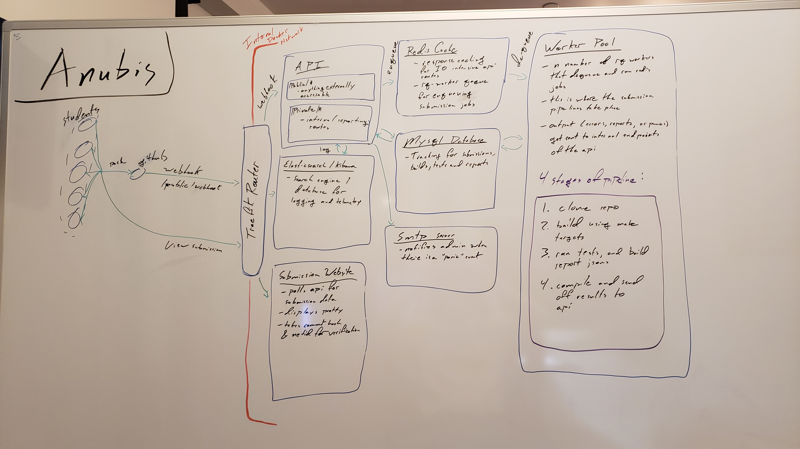

# Anubis

Anubis is a cluster of services that work together to automatically test and grade OS3224 
assignment submissions. 

## Overview
The basic flow of a submission (from the students prospective) is as follows:

1. A students use github classroom to get a template repo for an assignment.
2. Students make changes as necessary, then commit and push their changes to their github repo. 
(triggering a webhook to Anubis)
3. The student can then go to the Anubis website in their browser and get live updates and feedback 
of the tests for that assignment.
4. From the feedback they got from step 3 they should know if their code passes basic tests. If they
fail the tests, they should go back to step 2.

This is quite simply a large scale CD/CI for OS3224 assignments with some other metrics, and tracking 
built in. If you are unfamiliar with what CD/CI is, you can read up on it 
[here](https://en.wikipedia.org/wiki/CI/CD).

