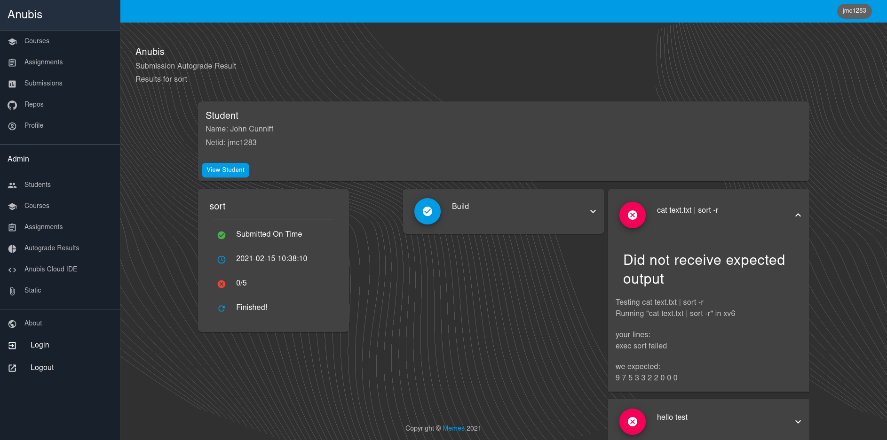

# Anubis LMS

  

# Table of contents

* [Design and Internals](#design-and-internals)
* [Blog](#blog)
* [What is this project?](#what-is-this-project?)
  * [Autograding](#autograding)
  * [Anubis Cloud IDEs](#anubis-cloud-ides)
  * [Insights](#insights)
* [How to contribute](#how-to-contribute)
* [Further reading](#further-reading)
* [License](#license)

## Design and Internals 

Want to know how Anubis works internally? We have a 20+ page design doc that thoroughly explains how Anubis works 
under [our docs](./docs). Don't worry, there are a lot of pictures :)

## Blog

Be sure to check out our [blog](https://anubis.osiris.services/blog)!

## What is this project?

Anubis is a distributed LMS (learning management system) created by [John Cunniff](https://github.com/wabscale) that 
is specifically designed for automating CS courses. Anubis has been used and battle tested at [NYU Tandon](https://engineering.nyu.edu/)
for several semesters. The main purposes of this system is to autograde homework submissions, and provide our own Cloud IDE solution to 
simplify the student experience.

> _Anubis is built by CS students for CS students_

### Autograding

Under Anubis each student gets their own github repo for each assignment. When they push to their repos, Anubis sees the
push and runs tests on their code. The results are then available to students on the Anubis website _before the deadline_
Under this model students can push as many times as they would like before the assignment deadline.

> _If you would like to read more on how autograding and assignment management works from a TA/Professors
> perspective, check out our [detailed design doc](docs/README.md)_

### Anubis Cloud IDEs

Anubis also provides student one click Cloud IDEs that are accessible in the browser. The Cloud IDEs are optimized for
each courses needs. Students can get a fully insulated, pre-configured, and stable IDE and linux environment in seconds.
No more clunky cloud VM solutions, or spending the first several weeks of the class getting Vagrant to work on hundreds
of student laptops. Students do not need to install, or configure anything for Anubis. Everything is accessible in 
the browser.

> _If you would like a more detailed description of how the IDEs work internally, check out the 
> [sections on the IDEs in our design doc](docs/README.md)_ 

### Insights

Simply by placing timestamps on thing that are already tracked like submissions and the test results for submissions, 
we can start to both ask and answer some interesting questions about how well students are understanding certain topics.

> _For a more detailed description (plus visuals) of how admin insights work in Anubis, check out
> the [section on usage statistics in our design doc](/docs/README.md)_

## How to contribute

- Checkout the [project board](https://github.com/GusSand/Anubis/projects/1) to see what you can 
contribute
- Checkout our [Development Guide](./docs/development_guide.md) to get up and running debugging Anubis
- Checkout the [Contribution Guide](./.github/CONTRIBUTING.md) to see how to submit PRs and Issues

## Further reading

The best place to get familiar with the internals of Anubis is to read our 
[very comprehensive design doc](docs/README.md). Try finding the places in the code that are referenced in the code doc.
You will get familiar with the layout of the project, and the internals of the system.

## License

Anubis is available under the [MIT license](https://opensource.org/licenses/MIT). Anubis also includes external 
libraries that are available under a variety of licenses. See [LICENSE](./LICENSE) for the full license text.
