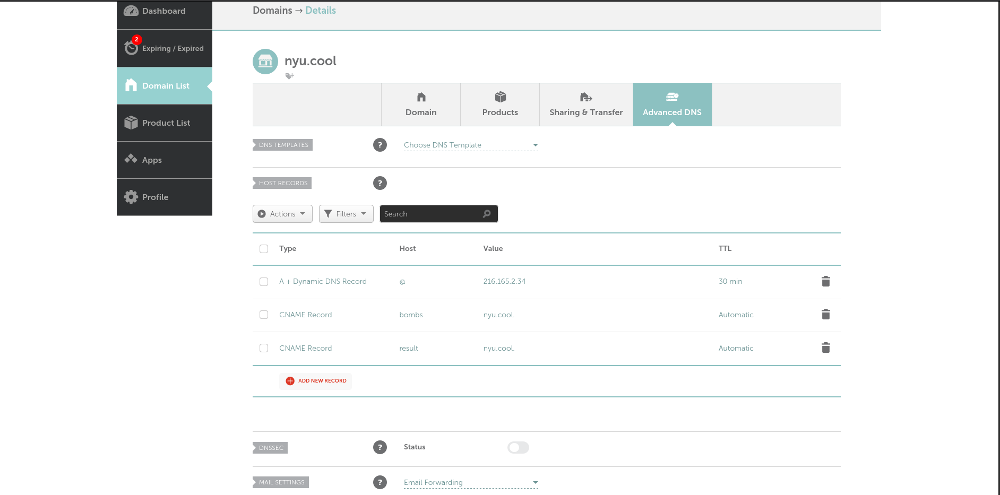

# DNS
You will need to have DNS entries for the three microservices that are accessable.
The deploy scripts will assume that you have one domain with multiple subdomains to
the other services. If you have never dealt with setting up a DNS entry before, it 
is quite simple. I would recommend that you buy a domain for cheap off [namecheap](https://www.namecheap.com/).
There are two types of entries you will need to deal with here. There are A records,
which point domains at ip addresses, and CNAMES with point domains at domains. Go
ahead and put an A record down for your pay level domain (the domain that you paid for).
Have its value be the ip address of the server. Make its host @. Then you will need to
put down CNAME records for host value combinations (bombs, [your domain]), and 
(result, [your domain]). Your namecheap advanced dns panel for your domain should look 
something like this:

