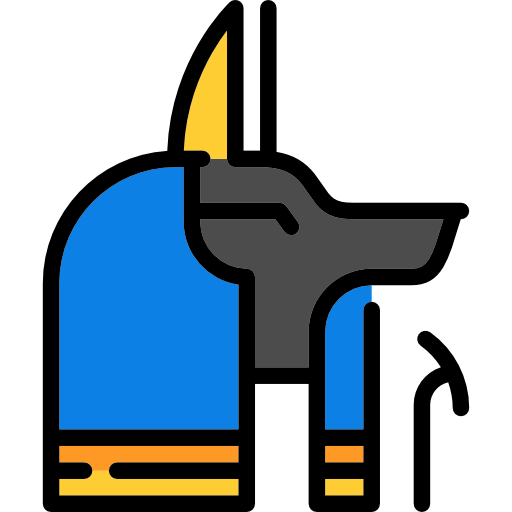

Generated from doc/design-tex/anubis-design.tex using pandoc
[see anubis-design.pdf for offical](anubis-design.pdf)
`pandoc -s --toc anubis-design.tex -o ../README.md`
<!-- -->
---
abstract: |
  The Anubis Learning Management System (LMS) is a tool designed
  specifically to automate Computer Science courses. Cloud IDEs
  integrated into Anubis provide students with a one click stable,
  consistent and inulated linux environment in their browser. While
  students work on their assignments, the provides live autograded
  feedback *before the deadline*. Powerful behavioral insights are
  generated for TAs and Professors from data collected by the platform.
author:
- |
  John McCann Cunniff Jr\
  New York University\
  Brooklyn, New York\
  `john@osiris.cyber.nyu.edu`\
  [^1]\
date: 2021-07-03
title: Anubis Learning Management System
---

-   [Project Overview](#ch:overview)
    -   [Autograding](#sec:autograding)
    -   [Anubis Cloud IDEs](#sec:anubis-cloud-ides)
    -   [Insights](#sec:insights)
-   [Autograding](#ch:assignments)
    -   [Assignment Structure](#sec:assignment-structure)
    -   [Creating Autograde Tests](#sec:creating-autograde-tests)
    -   [Writing Autograde Tests](#sec:writing-autograde-tests)
    -   [Deploying Autograde Tests](#sec:deploying-autograde-tests)
    -   [Submission Pipelines](#sec:submission-pipelines)
        -   [Kubernetes Job](#subsec:kubernetes-job)
        -   [Pipeline State Reporting](#subsec:pipeline-state-reporting)
        -   [Pipeline Stages](#subsec:pipeline-stages)
        -   [A Word on Isolation](#subsec:a-word-on-isolation)
-   [Anubis Cloud IDEs](#ch:cloud_ides)
    -   [Cloud IDE Overview](#sec:cloud-ide-overview)
    -   [Packaging of Course
        Software](#sec:packaging-of-course-software)
    -   [IDE Guarantees](#sec:ide-garantees)
        -   [Scaling IDEs](#subsec:scaling-ides)
        -   [Balancing Network
            Traffic](#subsec:balancing-network-traffic)
    -   [IDE Pod Design](#sec:ide-pod-design)
    -   [IDE Resources](#sec:ide-resources)
-   [Insights](#ch:insights)
    -   [High Level Usage Stats](#sec:high-level-usage-stats)
    -   [Class Level Autograde Results](#sec:class-level-results)
    -   [Student Level Autograde Results](#sec:student-level-results)
-   [Services](#ch:services)
    -   [Traefik Edge Router](#sec:traefik)
    -   [Anubis API](#sec:api)
        -   [Zones](#subsec:api-zones)
        -   [Public Zone](#subsec:api-public-zone)
        -   [Admin Zone](#subsec:api-admin-zone)
        -   [Health Checks](#subsec:api-health-checks)
        -   [Responsibilities](#subsec:api-responsibilities)
        -   [Authentication](#subsec:api-authentication)
    -   [Anubis Web Static](#sec:web)
    -   [Anubis Theia Proxy](#sec:theia-proxy)
    -   [Reaper CronJob](#sec:reaper)
        -   [Reaping IDE Resources](#subsec:reaping-ide-resources)
        -   [Reaping Submission Pipeline
            Resources](#subsec:reaping-submission-pipeline-resources)
        -   [Searching and Fixing Broken
            Submissions](#subsec:reaping-fixing)
    -   [RPC in Anubis](#sec:rpc-in-anubis)
        -   [Regrade RPC](#subsec:regrade-rpc)
        -   [Theia RPC](#subsec:theia-rpc)
        -   [Default RPC](#subsec:default-rpc)
-   [Deployment](#ch:deployment)
    -   [Data Stores](#sec:data-stores)
        -   [Mariadb](#subsec:mariadb)
        -   [Redis](#subsec:redis)
        -   [Caching](#subsec:caching)
        -   [RPC Queues](#subsec:rpc-queues)
    -   [Logging](#sec:logging)
        -   [Filebeat](#subsec:filebeat)
        -   [Elasticsearch](#subsec:elasticsearch)
    -   [Kubernetes](#sec:kubernetes)
        -   [Helm Chart](#subsec:helm-chart)
        -   [Longhorn](#subsec:longhorn)
        -   [Digital Ocean](#subsec:digital-ocean)
    -   [Github](#sec:github)
        -   [Github Organizations](#subsec:github-orgs)
        -   [Github Push Reporting](#subsec:github-push-reporting)
        -   [Github Classrooms](#subsec:github-classrooms)

::: titlepage
::: center
{width="30%"}
:::
:::

![The Anubis Cluster[\[fig:cluster\]]{#fig:cluster
label="fig:cluster"}](design-tex/figures/cluster.mmd.png){#fig:cluster
width="100%"}

# Project Overview 

The Anubis LMS is a tool to give students live feedback on homework
assignments while they are working on them and before the deadline.
Instead of having students submit a patch file or individual files, each
student will have their own private github repository for every
assignment. The way students then submit their work is simply by pushing
to their repo before the deadline. Students submit as many times as they
would like before the deadline.

When a student pushes to their assignment repo, a job is launched in the
Anubis cluster. That job will build their code, and run tests on the
results. Students can then use the live feedback to see which areas they
need to improve on before they get their final grades.

## Autograding 

When a student pushes to their assignment repo, a job is launched in the
Anubis cluster. That job will build their code, and run tests on the
results. Students can then use the live feedback to see which areas they
need to improve on before they get their final grades.

## Anubis Cloud IDEs 

New in version v2.2.0, there is now the Anubis Cloud IDE. Using some
kubernetes magic, we are able to host [theia](https://theia-ide.org/)
servers for individual students. These are essentially VSCode instances
that students can access in the browser. What makes these so powerful is
that students can access a terminal and type commands right into a bash
shell which will be run in the remote container. With this setup
students have access to a fully insulated and prebuilt linux environment
at a click of a button.

## Insights 

Anubis passively captures very interesting usage data from users. Most
users elect to using the Cloud IDEs as they offer an easily accessable
environment. When they do this, an autosave process pushes their work to
github every few minutes, triggering submission tests. With this
feedback loop, Anubis can capture near minute by minute progress on an
assignment for most all users.

# Autograding 

Much of this chapter will be assuming that you are using the Anubis
Management IDE. These are special Anubis Cloud IDEs
[3](#ch:cloud_ides){reference-type="ref" reference="ch:cloud_ides"} that
have the CLI and docker packaged into them. These IDEs are only
available to course admins.

## Assignment Structure 

Under Anubis each student gets their own github repository for each
assignment. When they push to their repo, Anubis sees the push event and
runs tests on their code. The results are then available to students on
the Anubis website in real time. Under this model students can push as
many times as they would like before the assignment deadline.

Assignment repositories are created from template repositories. TAs or
professors can set up a repo with the necessary files or starter code
for students to work on. Template repositories can be set up in such a
way that constrains student code. With C or C++ assignments, adding some
starter files with a Makefile constrains students to all start from the
same point. Instead of getting *N* submissions all with different file
names and run options, everyone's code will compile and run with the
same commands. This structure makes automating tests trivial and
effective.

## Creating Autograde Tests 

Using the anubis cli, you can initialize a new assignment using \|anubis
assignment init \<name of assignment>\|

The first file you will want to edit is the *meta.yml* that gets
created. This is where things like the assignment name, and due dates
should be defined. There is also a generated unique code that anubis
uses to identify this assignment. Hold on to this, as we will use it in
the next step.

``` yaml
assignment:
  name: "OS Final Exam"
  class: "CS-UY 3224"
  hidden: false

  # Optionally specify the github classroom link
  # for students to get their repo.
  #
  #  !! Remember to set the Custom repository
  #  !! prefix to {name}-{unique_code}
  #  !! when creating the assignment on
  #  !! Github Classroom
  github_classroom_url: "...."

  # Don't change these!
  unique_code: "839f70b2"
  pipeline_image: "registry.digitalocean.com/anubis/assignment/{unique_code}"

  # Specify the important dates here
  # * Remember! These are interpreted as America/New_York *
  date:
    release: "2021-05-17 06:00:00"
    due: "2021-05-19 06:00:00"
    grace: "2021-05-19 06:30:00"

  # This description will be shown to the user on the Anubis website.
  description: |
    Good luck.
```

Here is an example generated meta.yml from the OS final exam this
semester. The only fields that you will need to fill in are the github
classroom url. This is the URL that is given to you when you create a
github classroom assignment. That link will then be provided as a button
for students to click on the Anubis website.

## Writing Autograde Tests 

All the files to build and run a complete anubis pipeline image will be
dropped into the new directory.

``` text
new-assignment
|- assignment.py
|- Dockerfile
|- meta.yml
|- pipeline.py
|- test.sh
`- utils.py
```

The only thing you will ever need to edit is assignment.py. This is
where you define your build and test code. Just like all the other cool
libraries out there, the anubis pipeline works through hooking
functions. Here is a minimal example of an assignment.py that will build
and run a single simple test.

``` python
from utils import register_test, register_build, exec_as_student
from utils import (
    TestResult, BuildResult, Panic, DEBUG,
    xv6_run, did_xv6_crash,
    verify_expected, search_lines, test_lines
)

@register_build
def build(build_result: BuildResult):
    stdout, retcode = exec_as_student('make xv6.img fs.img')

    build_result.stdout = stdout.decode()
    build_result.passed = retcode == 0


@register_test('test echo')
def test_1(test_result: TestResult):
    test_result.stdout = "Testing echo 123\n"

    # Start xv6 and run command
    stdout_lines = xv6_run("echo 123", test_result)

    # Run echo 123 as student user and capture output lines
    expected_raw, _ = exec_as_student('echo 123')
    expected = expected_raw.decode().strip().split('\n')

    # Attempt to detect crash
    if did_xv6_crash(stdout_lines, test_result):
        return

    # Test to see if the expected result was found
    verify_expected(stdout_lines, expected, test_result)
```

There are a couple functions to point out here. The *register_build* and
*register_test* decorators are how you tell anubis about your build and
test. The *exec_as_student* function is how you should call any and all
student code. It lowers the privileges way down so that even if the
student pushes something malicious, they are still low privileged enough
where they cannot do much. It also adds timeouts to their commands.
Boxing student code in like this is absolutely essential. Do not
underestimate the creative and surprising ways students will find to
break things.

Each test is passed a *test_result* object. This object has 3 fields.
All you need to do is set the fields on the *test_result* object. The
results will then be reported to the anubis api, and then to the
student.

``` python
class TestResult(object):
    def __init__(self):
        # The standard out for the students tests. You can
        # add extra text in this field as needed.
        self.stdout: str = None

        # The message is an optional parameter that will
        # insert a short message in bold above the standard
        # out on the website frontend.
        self.message: str = None

        # Passed should be a boolean value. True if the test
        # passed, and False if it did not.
        self.passed: bool = None
```

The functions *run_xv6* and *did_xv6_crash* are very specific to the
Intro to OS needs. There are also some general functions that are just
as helpful.

``` python
def exec_as_student(cmd, timeout=60) -> typing.Tuple[bytes, int]:
    """
    Run a command as the student. Any and all times that student
    code is run, it should be done through this function. Any other
    way would be incredibly insecure.

    :param cmd: Command to run
    :param timeout: Timeout for command
    :return: bytes output, int return code
    """


def verify_expected(
    stdout_lines: typing.List[str],
    expected_lines: typing.List[str],
    test_result: TestResult,
    case_sensitive: bool = True,
    search: bool = False
):
    """
    Check to lists of strings for quality. Will strip off whitespace from each line
    before checking for equality. The stdout_lines should be from the student code.
    The expected_lines should then be whichever lines are expected for this test.

    * The fields on the test_result object will be set automatically based on if the
    expected output was found. *

    :param stdout_lines: students lines as a list of strings
    :param expected_lines: expected lines as a list of strings
    :param test_result: TestResult object for this test
    :param case_sensitive: boolean to indicate if the comparison should be case sensitive
    :param search: boolean to indicate if the stdout should be searched instead of
                   directly compared for equality
    :return:
    """


def test_lines(
        stdout_lines: typing.List[str],
        expected_lines: typing.List[str],
        case_sensitive: bool = True
) -> bool:
    """
    Test lines for exact equality. Whitespace will be stripped off each line automatically.

    * Optionally specify if the equality comparison should be case sensitive *

    >>> test_lines(['a', 'b', 'c'], ['a', 'b', 'c']) -> True
    >>> test_lines(['a', 'debugging', 'b', 'c'], ['a', 'b', 'c']) -> False
    >>> test_lines(['a', 'b'],      ['a', 'b', 'c']) -> False

    :param stdout_lines: students standard out lines as a list of strings
    :param expected_lines: expected lines as a list of strings
    :param case_sensitive: optional boolean to indicate if comparison should be case sensitive
    :return: True if exact match was found, False otherwise
    """


def search_lines(
        stdout_lines: typing.List[str],
        expected_lines: typing.List[str],
        case_sensitive: bool = True
) -> bool:
    """
    Search lines for expected lines. This will return true if all expected lines are in the
    student standard out lines in order. There can be interruptions in the student standard out.
    This function has the advantage of allowing students to still print out debugging lines
    while their output is still accurately checked for  the expected result.

    >>> search_lines(['a', 'b', 'c'], ['a', 'b', 'c']) -> True
    >>> search_lines(['a', 'debugging', 'b', 'c'], ['a', 'b', 'c']) -> True
    >>> search_lines(['a', 'b'],      ['a', 'b', 'c']) -> False

    * Optionally specify if the equality comparison should be case sensitive *

    :param stdout_lines:
    :param expected_lines:
    :param case_sensitive:
    :return:
    """
```

## Deploying Autograde Tests 

Once you have tests written, then it is time to push them to Anubis. The
next thing that needs to be done is push the image to the docker
registry and upload the assignment data to anubis. This is as simple as
running two commands:

``` shell
# sends assignment metadata to anubis api
anubis assignment sync

# builds then pushes the assignment
# pipeline image to the registry
anubis assignment build --push
```

## Submission Pipelines 

![Submission Pipelines are a complex multi service data flow.
[\[fig:submission-flow\]]{#fig:submission-flow
label="fig:submission-flow"}
](design-tex/figures/submission-flow.mmd.png)

Submissions Pipelines  are where the autographing is really happening.
When students push code to their github repositories, Anubis sees the
new commits and creates a pipeline job. Each commit to student github
repository gets a new Submission Pipeline.

### Kubernetes Job 

Each Submission Pipeline is a [Kubernetes
Job](https://kubernetes.io/docs/concepts/workloads/controllers/job/).
There are certain assurances that can be made when using Kubernetes
Jobs. If there is an issue on one node on the cluster that prevents a
submission job from finishing, Kubernetes will reschedule and retry the
Submission Pipeline elsewhere.

### Pipeline State Reporting 

Some assignment tests will also take a long time to process each
submission. Due to this reality, live state updating was added to the
Submission Pipelines.

There is an internal REST api that is only for submission pipelines to
report state to. This pipeline is called the *pipeline-api*. The
*pipeline-api* is specifically a subset of the main api. It has
different view functions defined for it. The purpose of these special
api servers is to take state updates from submission pipelines and
update the database.

If a submission is processing the website will poll for updates. This
complex multi service state reporting model is how results from isolated
submission pipelines appear on the website for students as they happen.

### Pipeline Stages 

It is important to note that at each stage of the submission pipeline,
we will be moving execution back and forth between two unix users. There
will be the entrypoint program managing the container as user *anubis*.
The *anubis* user will have much higher privileges than the *student*
user. The *student* user will be used whenever executing student code.
It will not have any level of access to anything from the *anubis* user.

#### Clone

In this initial stage, we will pull the current repo down from github.
After checking out the commit for the current submission, we will also
delete the *.git* directory as it is not needed. Lastly we will chown
the entire repo as *student:student*. This will then be the only place
in the container that the student user can read or write to (other than
/tmp of course).

#### Build

At this stage we hand execution off to student code for the first time.
Code must be built as the student user. The function that was marked
with the *register_build* decorator handles this phase. The stdout and
return code of the build will be captured by the *anubis* user. For most
assignments, the success of the build is determined by the return code.
No extra parsing of the stdout should be necessary.

#### Test

Tests are defined on a per-assignment basis. Again, student code will be
executed for this step. That code must be executed as the *student*
user.

Each test is defined as a python function that was decorated with the
*register_test* decorator. The function should run the student code for
whatever they are testing, then confirm that the standard out matches
whatever was expected.

The state updating at this step is automatic. After each test hook is
called, the results will automatically be sent off to the
*pipeline-api*.

After the last test is called, the pipeline sends a special state update
stating that the submission tests have completed. It is important that
this step happens as it is where the submission is marked as processed.

### A Word on Isolation 

We are executing student code in the submission pipeline containers. Due
to this reality, the pipelines are designed from the ground up to be
isolated in whatever way they can be.

There is a special [kubernetes network
policy](https://kubernetes.io/docs/concepts/services-networking/network-policies/)
that is applied to all the submission pipeline pods. This policy limits
the pod to only being able to connect to the *pipeline-api* service.
Using simple resource requests and limits in kubernetes enables limits
on resources like cpu and memory.

In early versions of Anubis, there were not memory limits on submission
containers. Several students would push code that would blow up in
memory. These students were not acting malicious, they just did not
understand how memory works in C that well. When this would happen, the
node would be quickly drained of available memory, and the OOM killer
would start taking other processes and containers down. Obviously this
lead to sensible resources limits being placed on student code. In more
modern versions of Anubis there is proper isolation and resource limits
that are placed on students.

# Anubis Cloud IDEs 

![Anubis Cloud IDE[\[fig:theia2\]]{#fig:theia2
label="fig:theia2"}](design-tex/figures/theia2.png)

## Cloud IDE Overview 

One of the more exciting new features of Anubis is that of the Cloud
IDEs. Anubis Cloud IDEs are [Theia](https://theia-ide.org/) IDE servers
that run in docker containers. Since the containers are themselves linux
environments, we can allow students to run commands in that environment
with the built in terminal in Theia.

## Packaging of Course Software 

Taking these IDE container servers to the next level, we can add
whatever other software is necessary for the course. Packaging the tools
that students need into a custom Theia server container built
specifically for the needs of the course are then available with one
click to students. Nothing to install, nothing to setup. All students
need is a modern web browser and an internet connection.

For many years, the CS-UY 3224 (Intro. to Operating Systems) course
jumped around from one VM solution to another. Each one posed challenges
with setting up for some subset of students. By using the Anubis IDEs,
this issue is completely removed. The tools necessary for the homeworks
are packaged into the of build of Theia that is used for the course. The
course VMs are then no longer necessary. Students have access to all the
tools they need through the Cloud IDE with one click.

## IDE Guarantees 

Leveraging some magic that Kubernetes and containers give us, we can
provide a fully insulated linux environment for hundreds of students
concurrently.

Any solution in the cloud that we provide for student need certain
assurances. The majority of students will rely on the Cloud IDEs to do
their homework. The system cannot fail right before a deadline when the
load on Anubis is greatest. Cloud IDEs need to be scalable. This
requires the system to distribute Cloud IDE instances across multiple
nodes. Networking traffic to Cloud IDEs need to also be automatically
detected and balanced.

### Scaling IDEs 

Kubernetes tracks what resources are reserved for specific containers.
When the cluster runs out of a resource like memory of cpu, it will
automatically add more nodes to the cluster and spread the load.
Resource reservations are added to each student Cloud IDE. If there are
more students asking for Cloud IDEs resources than exist in the cluster,
it will automatically scale to handle the load.

### Balancing Network Traffic 

There is a service in Anubis whose only purpose is to route student
requests to IDE instances. This service is called the *theia-proxy*.
See  to see where the *theia-proxy* fits into the deployment.

![Launch Anubis Cloud IDE[\[fig:theia1\]]{#fig:theia1
label="fig:theia1"}](design-tex/figures/theia1.png)

When a student clicks the button to create a Cloud IDE, an IDE pod is
created for that student . At the time that the pod is created, the in
cluster ip address of that pod is recorded in the database (called a
*ClusterIP*).

Once the Cloud IDE has been initialized, then a *goto ide* button will
become available. When clicked, the student will be redirected to the
address of the *theia-proxy* service. The proxy then parses the cookie
set for the user, and pulls the Cloud IDE pod ClusterIP address from the
database. The proxy then begins forwarding requests to the proper Cloud
IDE container. In a sense, the *theia-proxy* is a router for the IDEs.

The *theia-proxy* service is setup with a [Horizontal Pod
Autoscaler](https://kubernetes.io/docs/tasks/run-application/horizontal-pod-autoscale/)
or HPA. These are special kubernetes resources that will automatically
add or subtract containers from a deployment based on the resources in
use. The HPA for the *theia-proxy* is configured to detect when there is
prolonged cpu load and automatically add new proxy containers. The load
balancer will then automatically distribute incomming connections
between *theia-proxy* containers.

## IDE Pod Design 

![Anubis Cloud IDE design[\[fig:anubis-ide\]]{#fig:anubis-ide
label="fig:anubis-ide"}](design-tex/figures/theia-pod.mmd.png){#fig:anubis-ide
width="50%"}

The Cloud IDE pod design requires some finesse. There are a couple of
things about theia that make it so that we need to do some rather fancy
things in Kubernetes to make the setup work.

The main thing that we need to handle is the fact that theia requires a
websocket connection between the browser and theia server instance. When
the pods are allocated Anubis records the ClusterIP in the database.
Then when we need to initialize a client connection Anubis uses this
saved ClusterIP to forward requests (both http and websockets) to the
correct pod.

These IDE servers are temporary. When the student finishes working (or
after a timeout) we reclaim the resources by deleting the pod and shared
volume. Because of this, we needed some form of autosave. Saving is
pushing to github. The issue we need to contend with is automatically
committing and pushing to github without exposing a sensitive password
or api token to the students. We handle this by having a second
container whose only role is committing and pushing to github. The
credentials live in that container, completely separate and inaccessible
to the user who may be working in the other theia server container.
These two containers are connected by a shared volume mounted at
'/home/project' in both containers. This volume is relatively small
( 50MiB).

With this setup, we have autosave running in the background while being
completely hidden from the user. When explaining autosave to students we
usually just say \"it is witchcraft, just trust that it works\".

## IDE Resources 

The Anubis Cloud IDEs are lightweight containerized theia servers. Due
to this, we are able to support significantly more concurrent students
than if we had elected to implement a cloud VM solution. Because Anubis
Cloud IDEs do not need to virtualize hardware, the resources on the
system per each user is significantly less. Given the resources that we
have on Digital Ocean, we would be able to have maybe 20-30 concurrent
students using cloud virtual machines. With our containerized theia, we
can handle all  130 students in CS-UY 3224 at the same time with room to
breath.

# Insights 

## High Level Usage Stats 

There is a unavoidable wave of complains that flow in for every
assignment in CS-UY 3224 in the day or so before a deadline. The most
common is the classic *you did not give us enough time* excuse, even if
the assignment was assigned weeks before the deadline.

Something unique about spring semester of 2021 for CS-UY 3224 was the
introduction of the public usage graph on Anubis. This graph  is
generated every few minutes from live usage data in Anubis. It shows the
number of Cloud IDEs and submissions per hour for each assignment. Even
though it also has the due date for different assignments marked, you
could easily deduce the due date for each. It is always the day that the
usage spikes from basically nothing to hundreds of submissions per hour.

Our response to students asking for extensions was often just showing
the usage graphs in lecture. These graphs are an interesting experiment
in student behavior. They can prove that the majority of students wait
until the very last minute to do an assignment regardless of how long
the assignment has been released. I think most educators have assumed
this to be the case, but generating near live graphs from this behavior
is certainly an unique feature of Anubis.

![Public Usage Graph[\[fig:public-usage\]]{#fig:public-usage
label="fig:public-usage"}](design-tex/figures/public-usage-1.png){#fig:public-usage
width="50%"}

## Class Level Autograde Results 

A special visual is generated specifically for visualizing the success
of an assignment at a glance. This visual is called the Anubis Sundial .
It is a radial graph that shows the proportion of students that are
passing/failing tests for a specific assignment.

![The Anubis
Sundial.[\[fig:autograde-sundial-1\]]{#fig:autograde-sundial-1
label="fig:autograde-sundial-1"}
](design-tex/figures/sundial-1.png)

![Many students failed the long file lines
test.[\[fig:autograde-sundial-3\]]{#fig:autograde-sundial-3
label="fig:autograde-sundial-3"}
](design-tex/figures/sundial-3.png)

With this simple visualization professors can see which tests students
are struggling with. Sundials are generated live. At any time, even
before the due date, they will be available. For course administrators,
this means that they can see which tests students are struggling with.

Take the simple example in . By mousing over the sundial, we can see
that the tests with long file lines are failing. This information can
then lead to long line buffering being covered again in lecture or
recitation.

## Student Level Autograde Results 

Given the structure of Anubis assignments, coupled with the Anubis Cloud
IDEs we can track and measure each student's progress through an
assignment with near minute by minute precision. We can track and
measure when students start and finish their assignments, and how long
it takes them to pass specific tests. In the autograde results panel, a
\"visual history\" is generated for each student. It shows when students
started their assignment, then for each submission if their build passed
or failed and how many tests passed. If they used the Anubis Cloud IDEs
as most students do choose to, then the graph generated shows a near
minute by minute representation of which challenges they faced and how
long it took for them to overcome them.

![A Student Visual
History[\[fig:student-assignment-visual-history-1\]]{#fig:student-assignment-visual-history-1
label="fig:student-assignment-visual-history-1"}](design-tex/figures/student-assignment-visual-history-1.png){#fig:student-assignment-visual-history-1
width="90%"}

The example in  shows the build as the green line, and the assignment
tests as the blue line. We can see that this student spent a good deal
of time on the first day just getting their tests to pass, only to
revisit their work the next day probably to clean up their submission.

# Services 

## Traefik Edge Router 

![Traefik Traffic in Anubis[\[fig:traefik\]]{#fig:traefik
label="fig:traefik"}](design-tex/figures/traefik.mmd.png)

For our edge router, we use
traefik [5.1](#fig:traefik){reference-type="ref"
reference="fig:traefik"}. Traefik will be what actually listens on the
servers external ports. All external traffic will be routed through
Traefik. Above all else, we will be using Traefik's powerful routing
features to handle the ingress of requests.

Traefik lets us do some spicy and powerful stuff. We can route requests
to different services based off predefined rules, and even change
requests as they pass through.

Among other things, the routing rules make it so that we can have both
the static store and api on the same domain. The rules are set up such
that every request that starts with a path of
*anubis.osiris.services/api/\** goes to the
api [5.2](#sec:api){reference-type="ref" reference="sec:api"} service.
All other requests *anubis.osiris.services/\** are routed to the web
static [5.3](#sec:web){reference-type="ref" reference="sec:web"}
service.

In addition to having the web
static [5.3](#sec:web){reference-type="ref" reference="sec:web"} and the
anubis api [5.2](#sec:api){reference-type="ref" reference="sec:api"}
services on the same domain, we can add routing rules for the
theia-proxy [5.4](#sec:theia-proxy){reference-type="ref"
reference="sec:theia-proxy"} service. Anything that is
*ide.anubis.osiris.service/\** will be routed to the theia-proxy
service [5.4](#sec:theia-proxy){reference-type="ref"
reference="sec:theia-proxy"}.

By leveraging these features of Traefik, we can make it appear that the
services work different when being accessed externally.

## Anubis API 

The API is the backbone of Anubis. It is where most of the heavy lifting
is done. The service relies on both the
cache [\[sec:caching\]](#sec:caching){reference-type="ref"
reference="sec:caching"} and mariadb data
stores [6.1](#sec:data-stores){reference-type="ref"
reference="sec:data-stores"} to maintain state.

The Anubis API is itself nothing more than a simple
[Flask](https://flask.palletsprojects.com/en/2.0.x/) app. As of version
*v3.1.16* it is about 25,000 lines of python.

### Zones 

The API is split into two distinct, and uniquely treated zones. There is
a public and a admin zone. All endpoints for Anubis fall within one of
these zones. In the source code for Anubis, the views for these zones
exist in separate public and admin python modules.

All public view endpoints will start with the url
*anubis.osiris.services/api/public/\**. Similarly, the admin view
endpoints will start with *anubis.osiris.services/api/admin/\**.

### Public Zone 

The majority of the public API does require authentication. This is
mostly handled by the *\@require_auth* decorator applied to the view
function. Additional checks will be done to verify that the resource, or
calculation being requested are something the requester (the user making
the request) is authorized to see. The distinction must be made that
public here means that it is public to users. Students that open Anubis
in a web browser and navigate through their submissions and assignments
will only be using the public API.

### Admin Zone 

The admin api zone is where all the special endpoints that require
higher than student level permission reside. When a TA or Professor uses
any functionality of the Admin Panel, they are using these special admin
flask views. All of the view functions in the admin api module have
decorators like *\@require_admin()* or *\@require_superuser()*. These
protect the endpoints from anyone without admin permissions on at least
one course. Additional checks are then performed on each endpoint to
verify that whatever resource is being requested or modified is allowed
by the current user.

#### Course Context 

Most view functions for the admin api require a *course context* set in
the cookie of the request. When multi-course management was added to
Anubis, most all the view functions for the admin api needed to be made
*\"course aware\"*. What that means is that there needed to be a check
that the user making the request is an admin *and* is an admin for the
course that that resource resides under.

### Health Checks 

There are very simplistic health checks in the api that make debugging
issues much easier. The endpoint *anubis.osiris.services/* will run the
following view function:

``` python
    @app.route("/")
    def index():
        Config.query.all()
        cache_health()
        return "Healthy"
```

The view checks that the
database [6.1.1](#subsec:mariadb){reference-type="ref"
reference="subsec:mariadb"} is accessible by running a query, then calls
a function that relies on the redis
cache [6.1.3](#subsec:caching){reference-type="ref"
reference="subsec:caching"}. While this view function may be simple, it
is quite effective. Most of the incidents of degraded service or
downtime come down to either the database or cache being temporary
unavailable.

### Responsibilities 

The Anubis API is responsible for handling most basic IO, and state
managing that happens on the cluster. Some of this includes:

-   Authenticating users

-   Providing Class, Assignment, and Submission data to the frontend

-   Handling github webhooks

-   Handling reports from the submission pipeline cluster

-   Handling regrade requests

-   Initializing new IDE sessions

### Authentication 

To authenticate with the api, a token is required. The only way to get
one of these tokens is through NYU Single Sign On. By doing this, we are
outsourcing our authentication. This saves a lot of headaches while
being arguably more secure than if we rolled our own.

All of this is about 20 lines on our end. All that is necessary are some
keys from NYU IT.

## Anubis Web Static 

![Anubis Web Frontend[\[fig:web-frontend\]]{#fig:web-frontend
label="fig:web-frontend"}](design-tex/figures/anubis-frontend.png){#fig:web-frontend
width="75%"}

The web static service is nothing more than a simple static http
webserver. There are no moving parts that are necessary for this
service. Only the compiled reactjs, html and css files are found in this
service. One thing of note that is not in this service are most images.
The only images that are in this web static image are the logo favicons
and some others. The majority of images that are on the frontend
(through the blog or assignment questions and whatnot) are saved in the
database and accessed through the
api [5.2](#sec:api){reference-type="ref" reference="sec:api"}.

The frontend is designed to be a simple reflection of the backend data.
Once authenticated, users will be able to see the classes they are a
part of, current and past assignments, and all their submissions. With
few exceptions, the frontend is a near one to one translation of the
API's data models. Most pages will have a corresponding API endpoint.
The data shown on that page will be in exactly the form of the API
response.

## Anubis Theia Proxy 

The purpose of the the theia-proxy service it to route and forward
student requests to the appropriate Cloud
IDE [3](#ch:cloud_ides){reference-type="ref" reference="ch:cloud_ides"}
instances. Internals of this service are described in
section [3.3.2](#subsec:balancing-network-traffic){reference-type="ref"
reference="subsec:balancing-network-traffic"}

## Reaper CronJob 

Many of the resources that Anubis allocates within the cluster are short
lived. The Cloud IDE, and Submission Pipeline pods are the most fluid of
all. The Cloud IDEs will be created and destroyed at the behest of
students. The Submission Pipeline pods rarely last for more than a few
minutes. For these reasons Anubis needs a frequent recurring job that
keeps resources in check. This is where the reaper job comes in.

It compares the resources that are suppose to be allocated according to
the database, and the resources that are actually allocated in the
cluster. If there are IDE or Submission Pipeline resources that are
allocated that cannot be accounted for, or should be deleted, the reaper
will schedule them for deletion.

### Reaping IDE Resources 

When an IDE is created by a user, there is a record of the session added
to the database. With this table of records, the reaper can pull all the
IDE resources that should exist. The reaper can then pull the IDE
resources that do exist from the Kubernetes api.

Comparing these two sets there may be resources that should not exist
that do, or resources that should exist that do not. The reaper will
delete resources that should be deleted or mark sessions as ended if the
resources do not exist.

There is also a hard 6 hour limit on Anubis Cloud IDEs. Without this
limit, many students would create a Cloud IDE and just forget about it.
Obviously having these resources outstanding would be an expensive
problem for Anubis to have. The reaper handles this situation by
checking for active IDEs that have reached that 6 hour limit, and
schedules the resources for deletion.

In an interesting experiment in human behavior, we can plot the
cumulative duration (in minutes) of Cloud IDEs from the final exam from
CS-UY 3224's fall 2020 semester [5.3](#fig:theia3){reference-type="ref"
reference="fig:theia3"}. About 60% of all IDE sessions reached the 6
hour limit.

![Cumulative Duration of a Theia Session[\[fig:theia3\]]{#fig:theia3
label="fig:theia3"}](design-tex/figures/theia3.png)

### Reaping Submission Pipeline Resources 

Submission Pipelines are run as Kubernetes batch jobs. Batch jobs are
not automatically removed (at least not without enabling
[ttl-controllers](https://kubernetes.io/docs/concepts/workloads/controllers/ttlafterfinished/)).
Finished Submission Pipeline jobs are unnecessary resources.

For this reason, the reaper job will also schedule all finished and
successful Submission Pipeline batch jobs for deletion. Pipeline jobs
that failed for whatever reason are not deleted. This is purposeful in
design so that if there is an issue with a pipeline, there are logs that
can be examined.

### Searching and Fixing Broken Submissions 

The last main responsibility of the reaper is fixing broken submissions.
Anubis is what is called an [Eventually
Consistent](https://en.wikipedia.org/wiki/Eventual_consistency) system.
That means that there is a certain tolerance of short term inconsistency
that is expected and handled. Most inconsistencies are fixed by the
reaper cron.

The reaper cron searches recent submissions for common signs of
breakage. These breakages could be inconsistencies that were caused by a
failed or stalled Submission Pipeline for example. Depending on the
issue, the reaper may be able to fix or not. For issues that cannot be
fixed by the reaper, the submission is marked as broken.

Often if a student complains about some kind of inconsistency, the
problem is fixed before an Anubis admin can inspect it. The reaper has
saved countless hours for students and staff alike.

## RPC in Anubis 

Remote Procedural Calls are common place is many distributed systems.
Anubis relies on them quite heavily. Many workflows in Anubis push work
to RPC job queues through using the [python-rq](https://python-rq.org)
library.

These calculations happen asynchronously in worker deployments on the
cluster. RPC worker pods have additional
[RBAC](https://kubernetes.io/docs/reference/access-authn-authz/rbac/)
permissions that the api does not have. These permissions enable these
worker instances to interface with the kubernetes api in ways that the
api cannot. The RPC workers can create and destroy Cloud
IDE [\[ch:cloud-ides\]](#ch:cloud-ides){reference-type="ref"
reference="ch:cloud-ides"} and Submission
Pipeline [2.5](#sec:submission-pipelines){reference-type="ref"
reference="sec:submission-pipelines"} resources in the cluster.

Jobs are organized into separate queues depending on the subject of the
job. To learn more behind the reasoning for this separation, check out
the
[https://anubis.osiris.services/blog/midterm-retro](Spring 2021 Midterm Retro)
blog post.

### Regrade RPC 

Submission Pipeline create and or regrade jobs end up in the regrade
queue. The main reason this exists as its own queue is for bulk
regrades. When running a bulk regrade on an assignment there may be a
surge of thousands of jobs enqueued into the rpc queue (one for each
submission). To avoid a bulk regrade surge draining jobs triggered by
student from resources, this exists as its own queue

### Theia RPC 

All jobs that have to do with the Anubis Cloud
IDEs [\[ch:cloud-ides\]](#ch:cloud-ides){reference-type="ref"
reference="ch:cloud-ides"} end up in the theia rpc queue. When students
click the button to launch, or to stop a Cloud IDE a job is enqueued to
create or destroy the resources on the cluster.

For the deletion of IDE resources, the stop of the session appears to be
immediate. The resources are marked as deleted in the

### Default RPC 

Every job that is not a submission regrade or for a Cloud IDE makes its
way to the default queue. Some of these jobs include the generation of
visual data (either in raw form or image files) and autograding results.

# Deployment 

## Data Stores 

State in Anubis is somewhat fluid. Data is parked either in the main
Mariadb [\[subsec:mairadb\]](#subsec:mairadb){reference-type="ref"
reference="subsec:mairadb"} database, or in the redis
cache [6.1.3](#subsec:caching){reference-type="ref"
reference="subsec:caching"}.

### Mariadb 

The main data store for Anubis is a [MariaDB](https://mariadb.org/)
[galera](https://mariadb.com/kb/en/galera-cluster/) deployment. More
specifically the [Bitnami
mariadb-galera](https://github.com/bitnami/charts/tree/master/bitnami/mariadb-galera)
chart is used.

The advantage of galera is that MariaDB is multi-leader. Any node of the
MariaDB cluster can be read or written to at any time. In a multi leader
database deployment there is a certain tolerance of downed nodes before
service is degraded. Even if nodes begin to fail, the MariaDB pods that
are available can still handle read and write operations.

All persistent storage in Anubis is parked in MariaDB. Things like
student, course and assignment information are stored here. Temporary
values like autograde results are stored in
redis [6.1.2](#subsec:redis){reference-type="ref"
reference="subsec:redis"}.

### Redis 

[Redis](https://redis.io/) in Anubis is where temporary values are
stored. It is assumed that redis is not persistent. What this means is
that the redis deployment should be able to be reset at any time without
critical data loss. If and when values need to be persisted,
MariaDB [6.1.1](#subsec:mariadb){reference-type="ref"
reference="subsec:mariadb"} is the better option.

### Caching 

Caching in Anubis is handled by the
[flask-caching](https://flask-caching.readthedocs.io/en/latest/index.html)
library. The return values for specific functions can be temporarily
stored in Redis for some period of time.

In the Anubis API there is a great deal of caching. Almost all view
functions that query for database values will cache the results in redis
for some period of time.

Many of the computationally intensive calculation results are cached.
Take the autograde results for example. To calculate the best submission
for a student, all the calculated submission results for that student
and assignment must be pulled out of the database and examined.
Depending on the student and assignment, this calculation could involve
examining hundreds of submissions searching for the best. The results
for these autograde calculations are then stored in the cache.

For a 3 week window around each assignment deadline the autograde
results for the assignment are periodically calculated. The purpose of
this preprocessing is to ensure that the autograde results for recent
assignments are always available in the cache. Without this small
optimization, the autograde results page in the admin panel would just
about always require 15-30 seconds to load data.

Another example of heavy caching in Anubis would be the public usage
visuals. The visuals themselves are png images that are generated from
matplotlib. To generate the png we must periodically pull out all the
submission and cloud ide session information. Pulling this data then
generating the png can take upwards of 45 seconds to a minute. 45
seconds is obviously an unacceptable amount of time to wait for an image
to load in the browser. Anubis handles this situation by telling the API
to always load the cached png image from the cache. The image is then
periodically re-generated in the Reaper Cronjob.

Without heavy caching on things like the autograde results and visual
generation the admin panel would be quite slow.

### RPC Queues 

Redis is also used as an RPC broker for the
[python-rq](https://python-rq.org) library. RPC job information can be
sent to redis by the api. Deployments of RPC workers can then pick up
jobs for the queues that are assigned to them.

As stated before, Redis in Anubis is meant to be destroyable. When Redis
is destroyed, all the currently enqueued RPC jobs will be deleted along
with it. Often this is not the biggest deal in the world. The reaper
cron [5.5](#sec:reaper){reference-type="ref" reference="sec:reaper"} is
very good at spotting inconsistencies from events like Redis kicking
over and fixing them.

## Logging 

Logging in Anubis is handled by a few products in the
[elastic](https://elastic.co) ecosystem.

### Filebeat 

Filebeat is a log capturing tool that runs in the kube-system namespace.
It is configured to capture all container logs in the anubis kubernetes
namespace. The captures logs are then sent to elasticsearch for
indexing.

The result of this setup is that we can just print out whatever logs we
need to in whatever pod/container in the anubis namespace, and they will
be captured and indexed.

### Elasticsearch 

Anubis uses [elasticsearch](https://www.elastic.co/elasticsearch/) as a
search engine for logging, and event tracking. The elastic ecosystem has
other tools like [kibana](https://www.elastic.co/kibana/) for
visualizing data. Other than the visualization features, elastic allows
us to simply start throwing data at it without defining any meaningful
shape. This allows us to just log events and data into elastic to be
retrieved, and visualized later.

Kibana is not packaged with Anubis anymore because it is not used often
enough to merit the memory resources that it requires.

## Kubernetes 

Anubis is heavily integrated with concepts of
[Kubernetes](https://kubernetes.io/) (also called k8s). Features from
this container orchestrator are used to make all of the fancy things
that Anubis can do possible. Things like the Anubis Cloud
IDEs [3](#ch:cloud_ides){reference-type="ref" reference="ch:cloud_ides"}
would simply not exist without pod scheduling and resource scaling.

### Helm Chart 

Helm is like a package manager for Kubernetes. Kubernetes configuration
is all in yaml files. Helm enables an application to be packaged in
template yaml files. A *values.yaml* file can then provided to fill in
variables in the template yaml. A helm package is called a chart.

Anubis is packaged as a helm chart. By doing this, Anubis is an
application that can be *installed* to any k8s cluster (with some minor
configuration of course).

There are several options for how to deploy anubis that can be specified
when running the deploy script at *kube/deploy.sh*. Notable options are
deploying in debug mode, setting the api replica count, or disabling
rolling updates. Options passed to the deploy script will be then passed
to helm.

``` shell
# Deploy in debug mode
./k8s/deploy.sh --set debug=true

# Set the initial number of replicas for the api service to 5
./k8s/deploy.sh --set api.replicas=5

# Disable rolling updates
./k8s/deploy.sh --set rollingUpdates=false
```

### Longhorn 

The [Kubernetes
StorageClass](https://kubernetes.io/docs/concepts/storage/storage-classes/)
that Anubis uses is [Longhorn](https://longhorn.io/). It allows us to
have
[ReadWriteMany](https://kubernetes.io/docs/concepts/storage/persistent-volumes/#access-modes)
volumes for things like the Cloud IDEs.

All important data is stored on 3x replicated Longhorn StorageVolumes.
Those volumes all have at least daily snapshots taken of them. At any
given time, we can reset any stateful service to a previous snapshot
from the last seven days.

For the things that are very important we have daily snapshots, and
extra replication. Longhorn makes this as simple as checking some boxes.
You can see here our
mariadb [6.1.1](#subsec:mariadb){reference-type="ref"
reference="subsec:mariadb"} 0 replica with triple replication, with a 7
day snapshot.

{width="50%"}

### Digital Ocean 

Anubis runs on a managed Kubernetes cluster in Digital Ocean. Most
hosting providers now have their own one click managed Kubernetes
clusters. The advantage of using a managed k8s cluster is that generally
node autoscaling is a feature that you can enable.

#### Nodes 

The Anubis cluster on Digital Ocean are set to autoscale node pools.
Kubernetes keeps track of reserved resources (like cpu and memory) and
will report *resource pressures* to digital ocean. When that happens,
more nodes will automatically be added to the cluster.

The autoscaling node pools is how autoscaling works in Anubis. When a
student creates a Cloud IDE, and the cluster does not have the cpu or
memory resources, Digital Ocean will automatically add another node to
handle the load.

#### Networking 

Anubis is accessed though a [Digital Ocean load
balancer](https://docs.digitalocean.com/products/networking/load-balancers/).
The load balancer will be what has the external IP address for Anubis on
the public internet. Requests will then be balanced between all nodes to
the traefik service.

## Github 

### Github Organizations 

Each class has their own Github organization. Repos generated through
Github
Classrooms [6.4.3](#subsec:github-classrooms){reference-type="ref"
reference="subsec:github-classrooms"} are then placed in the
organization.

### Github Push Reporting 

As explained in the assignment
structure [2.1](#sec:assignment-structure){reference-type="ref"
reference="sec:assignment-structure"} section, students get their own
private repository for each assignment. There are two ways that github
reports submissions to Anubis.

The github organization's that use Anubis all have webhooks setup for
push events. This means that every time someone pushes to a repository
in a github organization that has Anubis assignment repos, github sends
a webhook describing the push to the Anubis api. Unfortunately github
has not always been the consistent about successful deliveries of push
event webhooks. In earlier versions of Anubis, webhooks would often
fail. This would result in submissions basically getting lost. The next
option exists to solve this issue of lost submissions.

The second way that Anubis detects pushes to assignment repos is by the
github API. In the reaper job [5.5](#sec:reaper){reference-type="ref"
reference="sec:reaper"} that runs every few minutes, a call is made to
the github api to list all recent commits to repositories in github
organizations that Anubis is responsible for. If a commit is seen in
this api response that was not reported by a webhook, a submission
record is created and a pipeline enqueued.

### Github Classrooms 

Student's get their own github repositories for each assignment in
Anubis. The way that these repositories are created for students is
through github classrooms. Classrooms is an integration into each
classes github organization. Assignments in classrooms can then be
created by specifying a template repository. Students then use the link
that classroom gives to generate their own
repositories [6.1](#fig:github-classroom-1){reference-type="ref"
reference="fig:github-classroom-1"}.

![Assignment Repo Creation
Link[\[fig:github-classroom-1\]]{#fig:github-classroom-1
label="fig:github-classroom-1"}](design-tex/figures/github-classroom-1.png){#fig:github-classroom-1
width="50%"}

Anubis has a problem to contend with here. When Anubis picks up
submissions in repos, it needs to be able to tell which assignments on
Anubis get matches to which repos. The solution Anubis uses to solve
this is a short unique hash identifier for each assignment. When
creating the assignment on github classroom, a prefix for the title in
the repo can be
specified [6.2](#fig:github-classroom-2){reference-type="ref"
reference="fig:github-classroom-2"}. The unique hash identifier to be
used here is created in the meta.yaml file in the assignment tests, and
available in the assignment management page on the web admin panel.

![Github Classroom Repo
Prefix[\[fig:github-classroom-2\]]{#fig:github-classroom-2
label="fig:github-classroom-2"}](design-tex/figures/github-classroom-2.png){#fig:github-classroom-2
width="50%"}

[^1]: A special thanks to Professor Gustavo Sandoval who always believed
    in me
