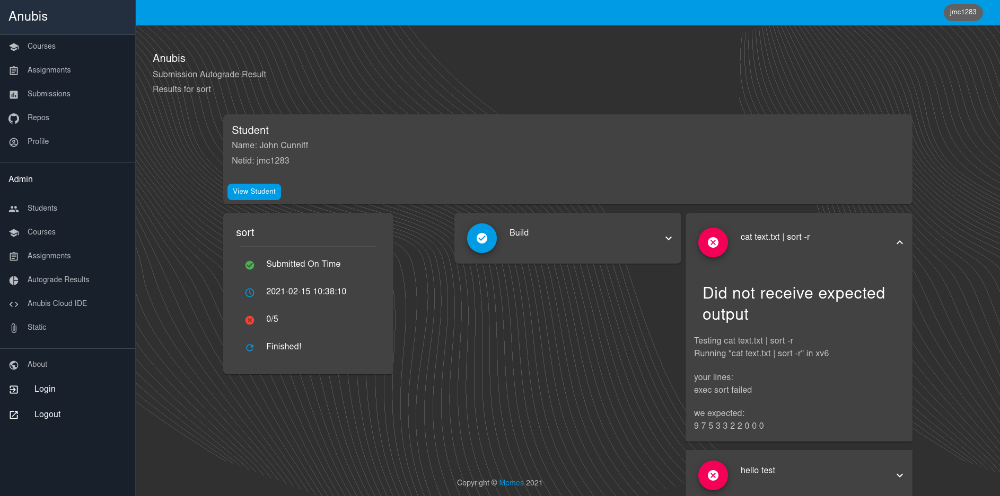
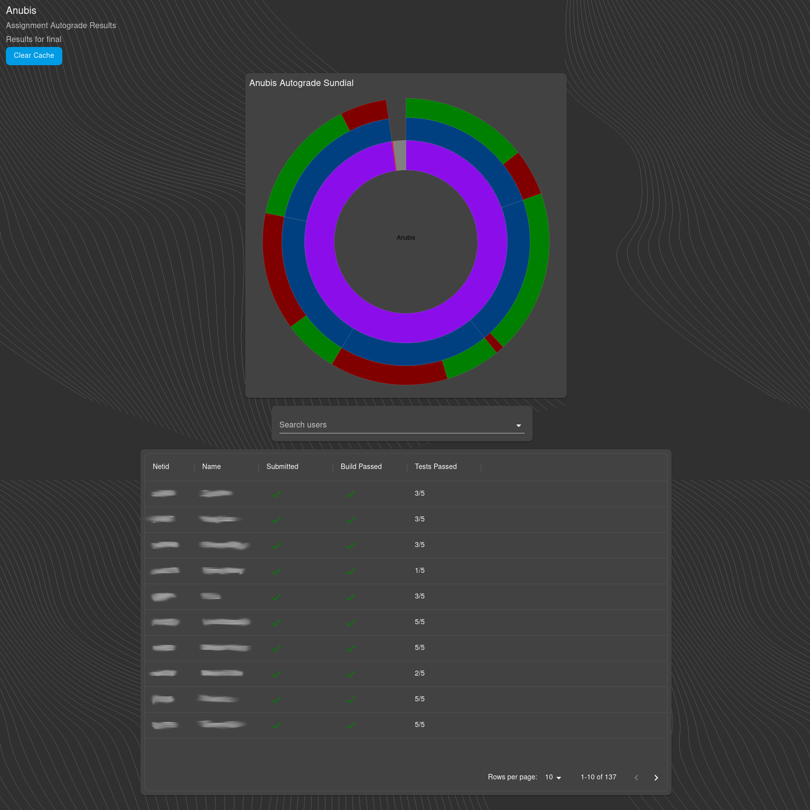
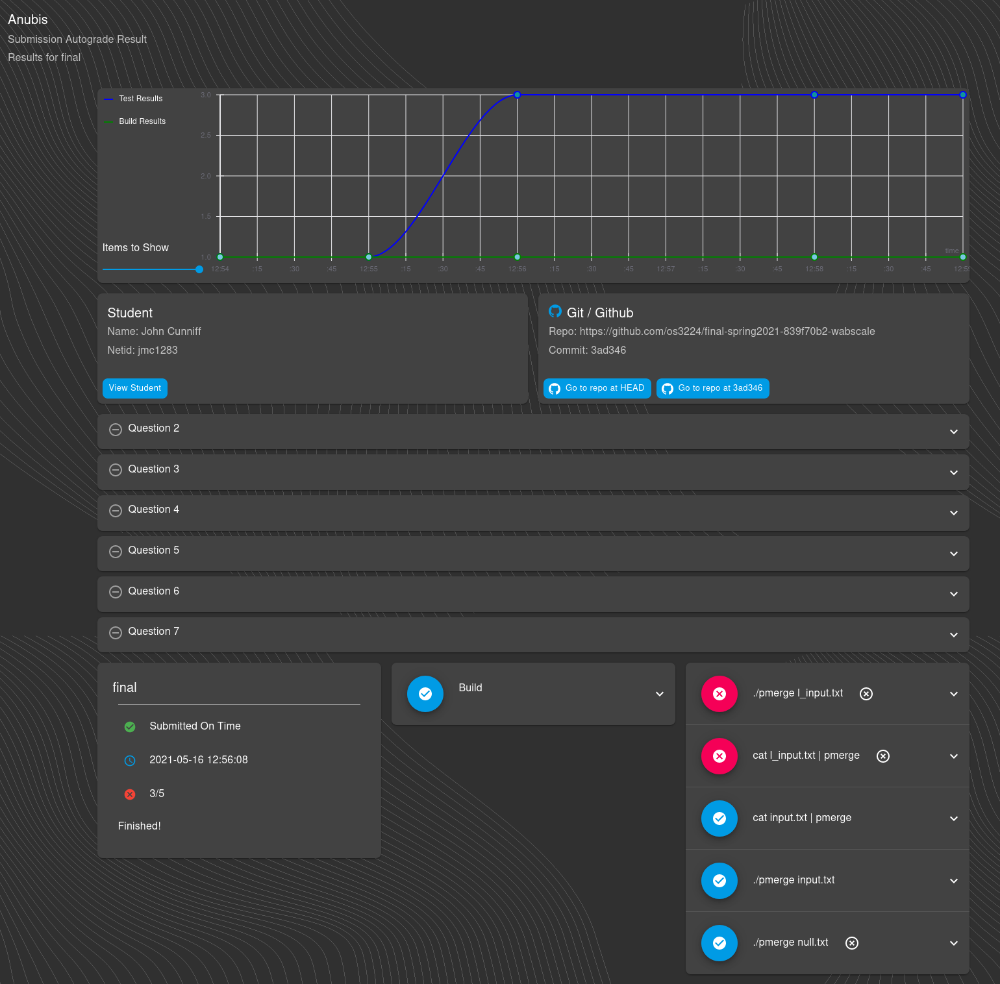
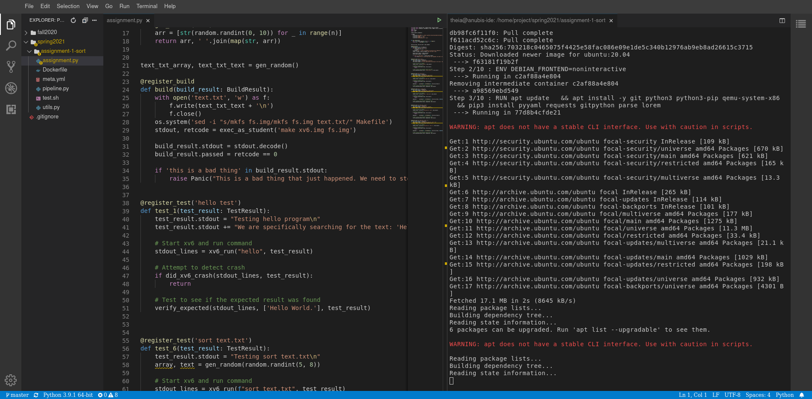
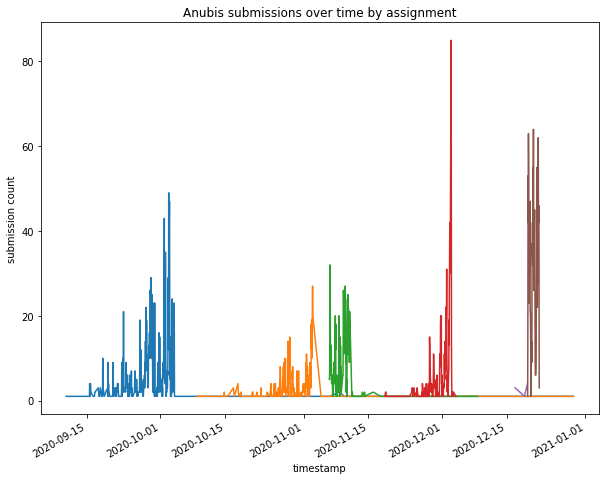
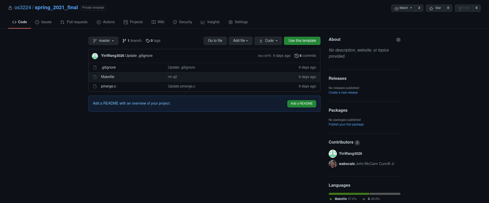
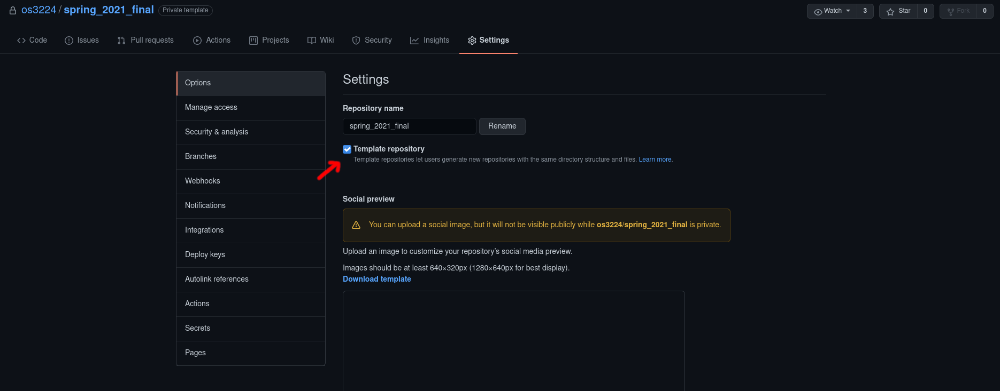
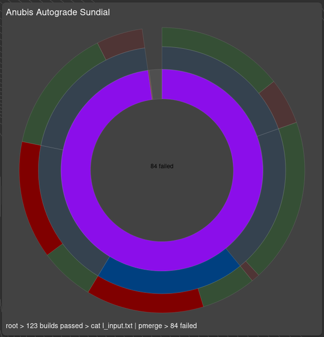
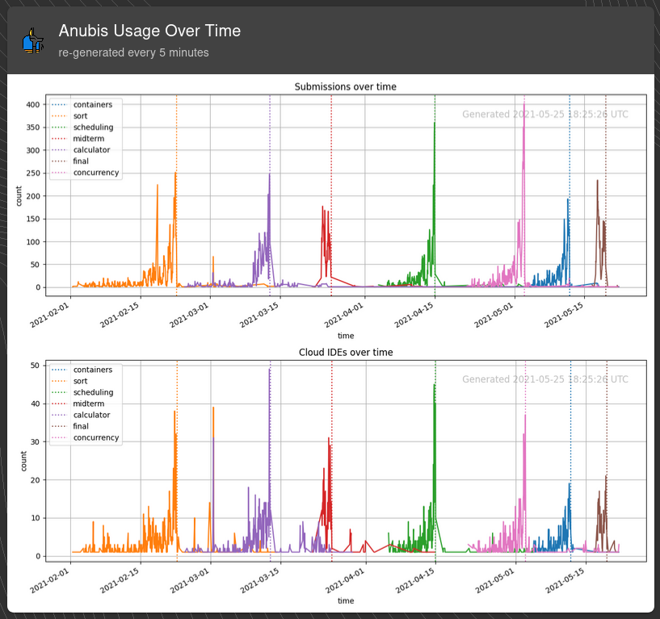

# Anubis LMS Design Doc


> Author: [John Cunniff](https://github.com/wabscale)

> Version: v3.1.0

\pagebreak


\pagebreak

# Contents
- [1 Overview](#1-overview)
  - [1.1 Elevator Pitch](#11-elevator-pitch)
  - [1.2 Motivations](#12-motivations)
- [2 Services](#2-services)
  - [2.1 Traefik](#21-traefik)
  - [2.2 API](#22-api)
    - [2.2.1 Zones](#221-zones)
    - [2.2.2 Responsibilities](#222-responsibilities)
    - [2.2.3 SSO Authentication](#223-sso-authentication)
  - [2.3 Submission Pipeline](#23-submission-pipeline)
    - [2.3.1 Kube Job](#231-kube-job)
    - [2.3.2 Submission State Reporting](#232-submission-state-reporting)
    - [2.3.3 Stages](#233-stages)
      - [Clone](#clone)
      - [Build](#build)
      - [Test](#test)
  - [2.4 Web Frontend](#24-web-frontend)
    - [2.4.1 Autograde Results](#241-autograde-results)
  - [2.5 Anubis Cloud IDE](#25-anubis-cloud-ide)
    - [2.5.1 IDE Frontend](#251-ide-frontend)
    - [2.5.2 Theia Pod Design](#252-theia-pod-design)
    - [2.5.3 Reclaiming Theia Resources](#253-reclaiming-theia-resources)
    - [2.5.4 Management IDE](#254-management-ide)
  - [2.6 Datastores](#26-datastores)
    - [2.6.1 Mariadb](#261-mariadb)
    - [2.6.2 Elasticsearch](#262-elasticsearch)
    - [2.6.3 Kibana](#263-kibana)
    - [2.6.4 Redis + RQWorker](#264-redis--rqworker)
    - [2.6.5 Redis + flask-caching](#265-redis--flask-caching)
  - [2.7 Logging](#27-logging)
    - [2.7.1 filebeat](#271-filebeat)
- [3 Deployment](#3-deployment)
  - [3.1 Kubernetes](#31-kubernetes)
    - [3.1.1 Helm Chart](#311-helm-chart)
    - [3.1.2 Rolling Updates](#312-rolling-updates)
    - [3.1.3 Longhorn](#313-longhorn)
    - [3.1.4 Digital Ocean](#314-digital-ocean)
      - [3.1.5 Nodes](#315-nodes)
      - [3.1.6 Networking](#316-networking)
  - [3.2 Github](#32-github)
    - [3.2.1 Organization](#321-organization)
    - [3.2.2 Classroom](#322-classroom)
- [4 CLI](#4-cli)
  - [4.1 CLI in Management IDE](#41-cli-in-management-ide)
  - [4.2 CLI Usage](#42-cli-usage)
- [5 Assignments](#5-assignments)
  - [5.1 Creating an Assignment Template Repository](#51-creating-an-assignment-template-repository)
  - [5.2 Creating Assignment Tests](#52-creating-assignment-tests)
  - [5.3 Writing Tests](#53-writing-tests)
  - [5.4 Uploading Tests](#54-uploading-tests)
  - [5.5 Creating Github Classroom Assignment](#55-creating-github-classroom-assignment)
- [6 Usage Statistics](#6-usage-statistics)
  - [6.1 Student Progress](#61-student-progress)
  - [6.2 Class Progress](#62-class-progress)
  - [6.3 Public Usage Visuals](#63-public-usage-visuals)

\pagebreak

## 1 Overview

### 1.1 Elevator Pitch

At its core, the Anubis LMS is a tool to give students live feedback from their homework 
assignments while they are working on them and before the deadline. Instead of having students 
submit a patch file or individual files, each student will have their own private repo for 
every assignment. The way students then submit their work is simply by pushing to their repo before 
the deadline. Students submit as many times as they would like before the deadline.

When a student pushes to their assignment repo, a job is launched in the
Anubis cluster. That job will build their code, and run tests on the results.
Students can then use the live feedback to see which areas they need to improve on
before they get their final grades.

> live feedback, before final grades



New in version v2.2.0, there is now the Anubis Cloud IDE. Using some kubernetes magic, we are able to
host [theia](https://theia-ide.org/) servers for individual students. These are essentially VSCode instances
that students can access in the browser. What makes these so powerful is that students can access a terminal
and type commands right into a bash shell which will be run in the remote container. With this setup students
have access to a fully insulated and prebuilt linux environment at a click of a button.

> fully insulated and prebuilt linux environment at a click of a button


### 1.2 Motivations

The purpose of this paper is to both explain the design, and the features of the Anubis autograder.

One of the main goals for Anubis from the beginning
was to simplify the experience for students. There should not need to
be a learning curve with a learning management system like Anubis just
for students to turn in their homework. _Everywhere possible, Anubis
will fill in the blanks._ All they need to do is click a button to get an
ide, do their work and check their test feedback if they would like. The
feedback the system gives to students is entirely up to the Professor and TAs.
You could use the Anubis system just for autograding, or just
for the cloud IDEs or both! It is up to you which features of Anubis you
would like to integrate into your curriculum.

> Everywhere possible, Anubis will fill in the blanks

\pagebreak

## 2 Services

### 2.1 Traefik

For our edge router, we use [traefik](https:/.traefik.io/). Traefik will be what actually
listens on the servers external ports. All external traffic will be routed through Traefik. Above all else,
we will be using Traefik's routing features to handle the Ingress of requests.

Traefik lets us do some spicy and powerful stuff. We can route requests to different services based off
predefined rules, and even change requests as they pass through. This makes it so that we can
have both the static store and api on the same domain. The rules are set up such that every request that
starts with a path of `/api` goes to the api service.

By leveraging these features of Traefik, we can make it appear that the services work different when
being accessed externally.

> One thing to note here is that when being accessed from within the cluster, none of these rules
> apply as we would be connecting directly to services.

### 2.2 API

The API is the backbone of anubis. It is where all the heavy lifting is done. The service relies on both
the [cache](#265-redis--flask-caching) and [mariadb](#261-mariadb) data stores to maintain state.

#### 2.2.1 Zones

The API is split into two distinct, and uniquely treated zones. There is a `public` and a `admin` zone.
All endpoints for Anubis fall within one of these zones.

These zones are simply paths that are treated differently depending on where the request is external. Namely,
for the admin zone external requests will require you to be marked as an admin. By adding this simple level of
authentication, we can lock down a section of the more sensitive API to only those authenticated from the outside.

#### 2.2.2 Responsibilities

The Anubis API is responsible for handling most basic IO, and state managing that happens on the cluster.
Some of this includes:

- Authenticating users
- Providing Class, Assignment, and Submission data to the frontend
- Handling github webhooks
- Handling reports from the submission pipeline cluster
- Handling regrade requests
- Initializing new IDE sessions

#### 2.2.3 SSO Authentication

To authenticate with the api, a token is required. The only way to get one of these tokens is through NYU
Single Sign On. By doing this, we are outsourcing our authentication. This saves a whole lot of headaches
while being arguably more secure than if we rolled our own.

All of this is about 20 lines on our end. All that is necessary are some keys from NYU IT.

### 2.3 Submission Pipeline

#### 2.3.1 Kube Job

A given submission pipeline is of the form of a Kubernetes [Job](https://kubernetes.io/concepts/workloads/controllers/job/).
These jobs have some built in assurances. A job is configurable to continue to launch new containers if a Pod fails.

#### 2.3.2 Submission State Reporting

At each and every stage of a submission pipeline, the job will report to the api with a state update. This state is
in the form of a string that describes what is currently happening at that moment. This data can then be passed along
to a user that is watching their pipeline be processed live.

Each unique per-assignment pipeline is packaged in the form of a docker image.

> See [Creating a new Assignment](#51-creating-a-new-assignment)

> An error at any stage of the submissions pipeline will result in an error being reported to the API, and
> the container exiting.

#### 2.3.3 Stages

It is important to note that at each stage of the submission pipeline, we will be moving execution back and
forth between two unix users. There will be the entrypoint program managing the container as user `anubis`. The
`anubis` user will have much higher privileges than the `student` user. The `student` user will be used whenever
executing student code. It will not have any level of access to anything from the `anubis` user.


##### Clone

In this initial stage, we will pull the current repo down from github. After checking out the commit for
the current submission, we will also delete the `.git` directory as it is not needed. Lastly we will
`chown` the entire repo as `student:student`. This will then be the only place in the container that the
student user can read or write to (other than /tmp of course).

##### Build

At this stage we hand execution off to student code for the first time. We will be building the student
code _as the `student` user_. The command for building the container will be specified by on a per-assignment
basis. The stdout of the build will be captured by the `anubis` user.

Once built, a build report will be sent to the API, along with a state update for the submission. If the
student is on the submission page, then they should be able to see the build info shortly thereafter.

##### Test

Tests will be defined on a per-assignment basis. Again we are executing student code, as the student user.

After each test, we will return to the entrypoint program as the `anubis` user. We will then send a report
of the last test before continuing to the next.

Once we reach the last test, we send off a separate notification to the API indicating the completion of
the pipeline. It is at that point that the API marks the submission as processed.

### 2.4 Web Frontend

The frontend is designed to be a simple reflection of the backend data. Once authenticated, users will
be able to see the classes they are a part of, current and past assignments, and all their submissions.
With few exceptions, the frontend is a near one to one translation of the API's data models. Most pages
will have a corresponding API endpoint. The data shown on that page will be in exactly the form of the
API response.

The submission page will poll for new data if the submission is not marked as processed. As it sees
new data, it will update what is displayed.

Located on the submission page, the purpose of the regrade button is to be a simple and easy way for
users to request regrades. When clicked, the frontend will hit a endpoint for requesting regrades.
If successful, the submission will be reset and re-enqueued in a submission pipeline.

#### 2.4.1 Autograde Results

Getting the autograde results is as easy as searching a name in the autograde results panel. You will
be taken to a page like this where the calculated best submission is shown. The best submission is the
most recent submission that passed the most tests.



The students see a reduced version of the submission information panel shown to the TAs and professors.
In the admin view, more data is displayed about the student. The students can see the status of the submission,
and the build and test results.

> *Calculating the best submissions requires heavy IO with the database. For this, the autograde results are
heavily cached. Results are updated hourly.*




### 2.5 Anubis Cloud IDE

One of the more exciting new features is that of the Cloud IDEs. Leveraging some magic that Kubernetes
and containers give us, we can provide a fully insulated linux environment for all ~130 students concurrently.

The [Theia IDE](https://theia-ide.org/) is a basically a VSCode webserver. They have base docker images for
specific languages.

Something very special about theia is that we can actually configure custom builds using a package.json. By doing this
we are able to compile in only the plugins we actually need/use. Then because they are docker images, any other software
that is needed for the course can be installed alongside the custom build of theia. Then students are one click away
from having a Cloud IDE that has all the VSCode extensions and other software needed.

With custom builds of theia we can also remove extra things that get installed by default. We can bring the default 
theia-cpp image down from 4GiB to ~1.5GiB. This is still an annoyingly large image, but hey, it's not 4GiB.

#### 2.5.1 IDE Frontend

Once students have created their repo, they will be able to launch a theia session for a given assignment. At that
time, Anubis clones exactly what is in their github repo into a theia pod.


Once their session pod has been allocated, they can click the goto session button. It is at this point
that their requests start to go through the theia proxy services. Assuming all goes well with initializing the session,
and starting the necessary connections, the student will have the access to their very own Cloud IDE.


Something to point out here is that this looks, feels, and acts exactly as VSCode, but it is accessed over the
internet. [Most VSCode extensions will just work on theia.](https://theia-ide.org/docs/composing_applications/#consuming-vs-code-extensions)

#### 2.5.2 Theia Pod Design

The Cloude IDE pod design requires some finesse. There are a couple of things about theia that make it so that
we need to do some rather fancy things in Kubernetes to make the setup work.

Distributing and handling multiple theia severs and concurrent connections is the name of the game here. We
need to be able to have a setup that scales well that is able to handle many users on the system at once.

The main thing that we need to handle is the fact that theia requires a websocket connection between the browser and
theia server instance. When the pods are allocated Anubis records the ClusterIP in the database. Then when we need to
initialize a client connection Anubis uses this saved ClusterIP to forward requests (both http and websockets) to the
correct pod.

These IDE servers are temporary. When the student finishes working (or after a timeout) we reclaim the resources by
deleting the pod and shared volume. Because of this, we needed some form of autosave. Saving is pushing to github.
The issue we need to contend with is automatically committing and pushing to github without exposing a sensitive
password or api token to the users. We handle this by having a second container whose only role is committing and
pushing to github. The credentials live in that container, completely separate and inaccessible to the user who
may be working in the other theia server container. These two containers are connected by a shared volume mounted
at `/home/project` in both containers. This volume is relatively small (~50MiB).

With this setup, we have autosave running in the background while being completely hidden from the user. When
explaining autosave to students we usually just say "it is witchcraft, just trust that it works".


With these lightweight containerized theia servers, we are able to support significantly more concurrent users than
if we had elected to implement a cloud VM solution. Because Anubis Cloud IDEs do not need to virtualize hardware,
the resources on the system for each user is significantly less. Given the resources that we have on Digital Ocean,
we would be able to have maybe 20-30 concurrent users using cloud virtual machines. With our containerized theia,
we can handle all ~130 students in CS-UY 3224 at the same time with room to breath.

#### 2.5.3 Reclaiming Theia Resources

The Cloud IDE sessions are often forgotten about. Students often create an IDE server work on it for a bit, then forget
about it. Due to this, we have a time to live of 6 hours for each session. A CronJob runs every 5 minutes to look
for and schedule deletes for stale resources. We do provide a button on the Anubis website as a way for students to manually
schedule their session for deletion. Even when we ask students to click this button when they are done, some still do not.
In the following graph we can see an interesting experiment in student behavior. It shows the cumulative duration of
a theia session for the final exam in the Fall 2020 semester for CS-UY 3224. Just about 40% of sessions are destroyed
after hitting the 6-hour timeout.


#### 2.5.4 Management IDE

Separate from the student xv6 IDE, there is also an admin build of theia that has some extra things. On the assignments
page of the admin panel, any TA or Professor can launch their own Management IDE. In this IDE the assignment-tests
repo is cloned instead of a student assignment repo. It has less networking restrictions, the anubis cli
and even docker running right in the pod. With this TA's and professors can create, modify, and deploy
assignments all from their browser.

Using some very clever authentication mechanics the management IDEs will be initialized with a personal token
that will be used by the CLI within the container. The result of this is that you can then just use the packaged
anubis CLI in the container, and your requests will be authenticated with the API. This authentication model also
enforces course aware permissions. What this means is that you will be able to create and modify assignments for
only the courses that you are a TA or Professor for.



### 2.6 Datastores

#### 2.6.1 Mariadb

Anubis uses the [bitnami MariaDB chart](https://hub.kubeapps.com/charts/bitnami/mariadb). It runs with 3 read-only
replication nodes, along with a main node that does read-write. The underlying MariaDB files are also
backed up with a [Longhorn](https://longhorn.io/) persistent volume that has 3x replication in the cluster.
The main volume has daily snapshots. Redundancy is the name of the game here.

The precise data model that we will be using is a simple relational database. From the API, we will interface
with Mariadb via [SQLAlchemy](https://www.sqlalchemy.org/).

Here is an example of a minimal mariadb deployment installed through the bitnami chart. Obviously for production we would
want to change the password from anubis to something stronger.

```shell
# Create a minimal mariadb deployment in a mariadb namespace. On
# prod, the mariadb is in a separate namespace, so we do the same
# here.
echo 'Adding mariadb'

# mariadb: ns-mariadb
#	helm upgrade --install mariadb bitnami/mariadb \
#		--set 'volumePermissions.enabled=true' \
#		--set 'auth.username=anubis' \
#		--set 'auth.database=anubis' \
#		--set "auth.password=$(DB_PASS)" \
#		--set 'replication.enabled=false' \
#		--namespace mariadb

make -C k8s/prod mariadb
```

#### 2.6.2 Elasticsearch

Anubis uses elasticsearch as a search engine for logging, and event tracking. The
[elastic ecosystem](https://www.elastic.co/) has other tools like [kibana](#263-kibana)
for visualizing data. Other than the visualization features, elastic allows us to simply start
throwing data at it without defining any meaningful shape. This allows us to just log events and data into
elastic to be retrieved, and visualized later.

The Elasticsearch stack is pretty annoying to manage on its own. Installing through an official chart is
much easier.

```shell
# Install a minimal elasticsearch deployments
echo 'Adding elasticsearch + kibana'

# elasticsearch: ns-elastic
#	helm upgrade \
#		--install elasticsearch elastic/elasticsearch \
#		--values elastic-values.yaml \
#		--version $(ELASTIC_VERSION) \
#		--namespace elastic

make -C k8s/prod elasticsearch
```

#### 2.6.3 Kibana

The Anubis autograder generates a lot of data. We have intense logging, and event tracking on every service.
When something happens on the cluster, it will be indexed into elastic. [Kibana](https://www.elastic.co/kibana)
is elastic's data visualization tool. It runs as a website that interfaces with the internal elasticsearch. Through
kibana, we can stream live logs, view event data, and create meaningful visualizations.

The API sees when students start an assignment (create their github repo), and when they are submitting
(pushing to their repo). This data is indexed into elasticsearch, and visualized via kibana. In Anubis version
v1.0.0 we were able to show graphs of when students were starting vs finishing their assignments. To no ones surprise,
the majority of the class was starting very late with a large influx of submissions in the few hours before each
deadline. Furthermore, we can show how long it takes for a student to start their assignment to when they have
their tests pass on average. We can also show which tests were causing students the most trouble.

Here is one such visualization of assignment submissions over time. The peaks are the few days before a due date.



This incredibly precise view into the actual data that can be generated on a platform such as Anubis is
something that sets it apart from its competitors. We can show meaningful statistics to the professors and TAs
on the platform about what went well with their assignment, and where students struggled.

#### 2.6.4 Redis + RQWorker

Redis has two purposes in Anubis. It is used by flask-caching to cache some endpoint and function
results. For most all the functions that are heavy on the database, the results are cached for a specified period
of time. The second purpose is as a rpc job broker. We use [python-rq](https://python-rq.org/) as it is super
simple and easy to configure and set up. Using rq, we can enqueue functions to be run by a deployment of rpc-worker
pods. Just about every time we need or want to do some work asynchronously, rq is used.

The redis setup needed for anubis is quite minimal. Again we would obviously want to change the password
here in prod.

```shell
# Install a minimal redis deployment
echo 'Adding redis'

# redis: ns-anubis
#	helm upgrade \
#		--install redis bitnami/redis \
#		--set fullnameOverride=redis \
#		--set global.redis.password=$(REDIS_PASS) \
#		--set architecture=standalone \
#		--set master.persistence.enabled=false \
#		--namespace anubis

make -C k8s/prod redis
```

#### 2.6.5 Redis + flask-caching

The redis instance is also used for caching function results. Some of the functionalities of Anubis require
a pretty large and time-consuming calculations that would be foolish to not cache. In particular calculating
autograde results and generating visuals are quite computationally intensive (not to mention the strain on the
database). By caching the results (and sometimes preprocessing then caching) the system is significantly
more responsive.

```python
@cache.memoize(timeout=5 * 60, unless=is_debug)
def autograde(student_id, assignment_id):
    """
    Get the stats for a specific student on a specific assignment.

    Pulls all submissions, then finds the most recent one that
    has the most tests that passed.

    * This function is heavily cached as it is IO intensive on the DB *

    :param student_id:
    :param assignment_id:
    :return:
    """
```

The library we use for this is [flask-caching](https://flask-caching.readthedocs.io/en/latest/index.html).

### 2.7 Logging

> _When in doubt, just log it_

#### 2.7.1 filebeat

Filebeat handles persistent logging. Filebeat is configured to capture all container logs from the 
`anubis` k8s namespace and index them into elasticsearch. The indexes are then set to maximum limits 
that will recycle space when full.

```shell
# Install filebeat deployments
echo 'Adding filebeat'

# filebeat:
#	helm upgrade \
#		--install filebeat elastic/filebeat \
#		--values filebeat-values.yaml \
#		--version $(ELASTIC_VERSION) \
#		--namespace kube-system

make -C k8s/prod filebeat
```

\pagebreak

## 3 Deployment

### 3.1 Kubernetes

The main goal with moving to Kubernetes from a simple single server docker-compose setup was scalability. We needed
to scale our load horizontally. No longer was adding more RAM and CPU cores to the VM viable. With more users, we
have a greater load. Kubernetes allows us to distribute this load across the servers in the clusters quite easily.

In moving to Kube, we are also now able to make guarantees about availability. In theory, even if sections of
physical servers on the cluster go offline Anubis will still remain available.
[More on that later...](#314-digital-ocean)

#### 3.1.1 Helm Chart

Anubis itself is packaged as a helm chart. Both mariadb and elasticsearch need to be setup separately. There
are several options for how to deploy anubis that can be specified when running the deploy script at `kube/deploy.sh`.
Notable options are deploying in debug mode, or restricting access to only the OSIRIS vpn. Options passed
to the deploy script will be then passed to helm.


```shell
# Deploy in debug mode
./k8s/deploy.sh --set debug=true

# Set the initial number of replicas for the api service to 5
./k8s/deploy.sh --set api.replicas=5

# Disable rolling updates
./k8s/deploy.sh --set rollingUpdates=false
```

A full list of options can be found in the [values.yaml](../k8s/chart/values.yaml) file.

#### 3.1.2 Rolling Updates

In the decisions that were made when considering when expanding Anubis, availability was of the most important.
Specifically we needed to move to a platform that would allow us to do _zero_ downtime deploys. Kubernetes has
very powerful rolling update features. We can bring up a new version of the Anubis API, verify that this new
version is healthy, then bring down the old version. All the while, there will be little to no degradation of service.

Of all the features of Kubernetes that Anubis leverages, none are quite as important as rolling updates. The
Anubis API can be updated to a new version with _zero_ downtime. This means we can live patch the Anubis even 
when under load. To hear about one such tricky deploy from the Spring 2021 CU-UY 3224 semester, check out 
[this blog post](https://anubis.osiris.services/blog/midterm-retro).

#### 3.1.3 Longhorn

The Kubernetes [StorageClass](https://kubernetes.io/concepts/storage/storage-classes/) that Anubis uses is Longhorn. It allows us to have ReadWriteMany volumes
for things like the Cloud IDEs.

All important data is stored on 3x replicated Longhorn StorageVolumes. Those volumes all have at least daily
snapshots taken of them. At any given time, we can reset any stateful service to a previous snapshot from the
last seven days.

For the things that are very important we have daily snapshots, and extra replication. Longhorn makes this
as simple as checking some boxes. You can see here our mariadb master image with triple replication
(two in Brooklyn one in Manhattan), with a 7 day snapshot.


#### 3.1.4 Digital Ocean

The official Anubis cluster is hosted on Digital Ocean.
Using their managed Kubernetes solution, the cluster can
balloon in resources when there are many students online.

The main benefits of using a managed cluster instead of
self hosting is ease of mind!

##### 3.1.5 Nodes

The cluster is comprised of Digital Ocean droplets in their NYC-1 datacenter.
When Kubernetes reports things like memory, cpu or disk pressure the node pools
are automatically scaled up to handle the increased load.

##### 3.1.6 Networking

The Digital Ocean cluster uses a loadbalancer to distribute the networking
load across all existing nodes. Traefik CRD is the reverse proxy that exists on
the cluster to handle the ingress.

### 3.2 Github

#### 3.2.1 Organization

Each class that will need a github organization to put all its repos under. The only members of that organization
should be the professor and TAs.

The organization should be set up to have push event webhooks to anubis. The endpoint the webhook should push
to is `https://anubis.osiris.services/api/public/webhook/`. That endpoint will be hit when there is a push to a
repo in that organization.

#### 3.2.2 Classroom

[Github classroom](https://classroom.github.com/) is used to create, and distribute repos for assignments.
There you can create assignments that will pull from a template repo of your choosing. A link will be generated
that can be distributed to students. When clicked, that link will generate a new repo for the student within the
class organization. As the student is not a part of the organization, they will not be able to see any of the
other student repos (given the assignment was made using a private repo).

The best place to put the template repo is within the class organization as a private repo.

One very important thing to note here is that in order to be able to create private assignment repo's, the
classroom you create must be verified by github. This can take a few weeks, and a professor needs to email
github asking for permission from a .edu email providing their title and whatnot.

> Getting your github classroom / org approved will likely cause delays if not done at least a month
> before the semester starts.


## 4 CLI

### 4.1 CLI in Management IDE

In the Anubis Management IDEs there is an anubis cli installed. When a
Management IDE is started, it is provisioned with the necessary authentication
tokens to communicate with the Anubis API.

The short version of this is that when you use an Anubis Management IDE it
is automatically pointed at the internal API and is authenticated to you.

### 4.2 CLI Usage

The main purposes of the CLI is for making it a bit easier for admins to make private API calls. In some
cases it will handle the input and output of files.

```
jc@aion ‹ master@61e1674 › : ~/nyu/os/assignment-tests/spring2021
[0] % anubis assignment init new-assignment   
Creating assignment directory...
Initializing the assignment with sample data...

You now have an Anubis assignment initialized at new-assignment
cd into that directory and run the sync command to upload it to
Anubis.

cd new-assignment
anubis assignment build --push
anubis assignment sync
```

Some use cases would be:
- Adding, Updating and Listing assignment data
- Adding, Updating and Listing class data
- Packaging a new assignment tests, and sending its data off to the cluster

## 5 Assignments

### 5.1 Creating an Assignment Template Repository

The first thing we need to do to create a new assignment is to create a template repo
that each student will start with. It is up to you what you would like students to start 
out with. Here is the template from the final exam for OS this semester. This template repo
only contains a hello world c program in the pmerge.c file, and some basic things necessary
to compile the pmerge program in the Makefile. 



We can then go into the settings of the repo, and mark it as a template. This is something
necessary for github classroom.



Simply by constraining students to have a specific file name for the program, and a
Makefile to match the submissions are much more uniform. What this means is that
we can have the assignment set up in such a way that everyone's code can be compiled
with the same command. This makes automating the tests much easier. It also can reduce
manual work that the TAs would need to do.

### 5.2 Creating Assignment Tests

Using the anubis cli, you can initialize a new assignment using `anubis assignment init <name of assignment>`

The first file you will want to edit is the `meta.yml` that gets created. This is where things
like the assignment name, and due dates should be defined. There is also a generated `unique_code`
that anubis uses to identify this assignment. Hold on to this, as we will use it in the next
step.

Here is an example generated `meta.yml` from the OS final exam this semester. The only fields that
you will need to fill in are the `github_classroom_url`. This is the URL that is given
to you when you create a github classroom assignment. That link will then be provided as a button
for students to click in the frontend.

```yaml
assignment:
  name: "final"
  class: "CS-UY 3224"
  hidden: true
  
  # Optionally specify the github classroom link
  # for students to get their repo.
  github_classroom_url: ""

  # Don't change these!
  unique_code: "839f70b2"
  pipeline_image: "registry.digitalocean.com/anubis/assignment/839f70b2"

  # Specify the important dates here (remember these are America/New_York)
  date:
    release: "2021-05-17 06:00:00"
    due: "2021-05-19 06:00:00"
    grace: "2021-05-19 06:30:00"
```

### 5.3 Writing Tests

All the files to build and run a complete anubis pipeline image will be dropped into the new directory.

```
new-assignment
|- assignment.py
|- Dockerfile
|- meta.yml
|- pipeline.py
|- test.sh
`- utils.py
```

The only thing you will ever need to edit is `assignment.py`. This is where you define your build and
test code. Just like all the other cool libraries out there, the anubis pipeline works through hooking
functions. Here is a minimal example of an assignment.py that will build and run a single simple test.

```python
from tests.utils import register_test, register_build, exec_as_student
from tests.utils import (
    TestResult, BuildResult, Panic, DEBUG, 
    xv6_run, did_xv6_crash, 
    verify_expected, search_lines, test_lines
)

@register_build
def build(build_result: BuildResult):
    stdout, retcode = exec_as_student('make xv6.img fs.img')

    build_result.stdout = stdout.decode()
    build_result.passed = retcode == 0


@register_test('test echo')
def test_1(test_result: TestResult):
    test_result.stdout = "Testing echo 123\n"

    # Start xv6 and run command
    stdout_lines = xv6_run("echo 123", test_result)

    # Run echo 123 as student user and capture output lines
    expected_raw, _ = exec_as_student('echo 123')
    expected = expected_raw.decode().strip().split('\n')

    # Attempt to detect crash
    if did_xv6_crash(stdout_lines, test_result):
        return

    # Test to see if the expected result was found
    verify_expected(stdout_lines, expected, test_result)

```

There are a couple functions to point out here. The `register_build` and `register_test` 
decorators are how you tell anubis about your build and test. The `exec_as_student` is how 
you should call any and all student code. It lowers the privileges way down so that even 
if the student pushes something malicious, they are still low privileged enough where they 
can not do much. It also adds timeouts to their commands. Boxing student code in like this
is absolutely essential. Do not underestimate the creative and surprising ways students will
find to break things.

Each test is passed a `test_result` object. This object has 3 fields. All you need to do
is set the fields on the `test_result` object. The results will then be reported to the
anubis api, and then to the student.

```python
class TestResult(object):
    def __init__(self):
        # The standard out for the students tests. You can 
        # add extra text in this field as needed.
        self.stdout: str = None
        
        # The message is an optional parameter that will 
        # insert a short message in bold above the standard 
        # out on the website frontend.  
        self.message: str = None
        
        # Passed should be a boolean value. True if the test
        # passed, and False if it did not.
        self.passed: bool = None
```

The functions `run_xv6` and `did_xv6_crash` are very specific to the Intro to OS needs.
There are also some general functions that are just as helpful.

```python
def exec_as_student(cmd, timeout=60) -> typing.Tuple[bytes, int]:
    """
    Run a command as the student. Any and all times that student
    code is run, it should be done through this function. Any other
    way would be incredibly insecure.

    :param cmd: Command to run
    :param timeout: Timeout for command
    :return: bytes output, int return code
    """


def verify_expected(
    stdout_lines: typing.List[str],
    expected_lines: typing.List[str],
    test_result: TestResult,
    case_sensitive: bool = True,
    search: bool = False
):
    """
    Check to lists of strings for quality. Will strip off whitespace from each line
    before checking for equality. The stdout_lines should be from the student code.
    The expected_lines should then be whichever lines are expected for this test.

    * The fields on the test_result object will be set automatically based on if the
    expected output was found. *

    :param stdout_lines: students lines as a list of strings
    :param expected_lines: expected lines as a list of strings
    :param test_result: TestResult object for this test
    :param case_sensitive: boolean to indicate if the comparison should be case sensitive
    :param search: boolean to indicate if the stdout should be searched instead of
                   directly compared for equality
    :return:
    """

    
def test_lines(
        stdout_lines: typing.List[str],
        expected_lines: typing.List[str],
        case_sensitive: bool = True
) -> bool:
    """
    Test lines for exact equality. Whitespace will be stripped off each line automatically.

    * Optionally specify if the equality comparison should be case sensitive *

    >>> test_lines(['a', 'b', 'c'], ['a', 'b', 'c']) -> True
    >>> test_lines(['a', 'debugging', 'b', 'c'], ['a', 'b', 'c']) -> False
    >>> test_lines(['a', 'b'],      ['a', 'b', 'c']) -> False

    :param stdout_lines: students standard out lines as a list of strings
    :param expected_lines: expected lines as a list of strings
    :param case_sensitive: optional boolean to indicate if comparison should be case sensitive
    :return: True if exact match was found, False otherwise
    """
    
    
def search_lines(
        stdout_lines: typing.List[str],
        expected_lines: typing.List[str],
        case_sensitive: bool = True
) -> bool:
    """
    Search lines for expected lines. This will return true if all expected lines are in the
    student standard out lines in order. There can be interruptions in the student standard out.
    This function has the advantage of allowing students to still print out debugging lines
    while their output is still accurately checked for  the expected result.

    >>> search_lines(['a', 'b', 'c'], ['a', 'b', 'c']) -> True
    >>> search_lines(['a', 'debugging', 'b', 'c'], ['a', 'b', 'c']) -> True
    >>> search_lines(['a', 'b'],      ['a', 'b', 'c']) -> False

    * Optionally specify if the equality comparison should be case sensitive *

    :param stdout_lines:
    :param expected_lines:
    :param case_sensitive:
    :return:
    """

```

### 5.4 Uploading Tests

Now you have your tests. That's great. The next thing you need to do is push the image to the docker registry and
upload the assignment data to anubis. This is as simple as running two commands:

```shell
# sends assignment metadata to anubis api
anubis assignment sync          

# builds then pushes the assignment
# pipeline image to the registry
anubis assignment build --push
```

### 5.5 Creating Github Classroom Assignment

Go to github classroom, and select the button to create a new assignment. You can name 
the assignment anything you would like. The most important
part of the process when creating a github classroom assignment is making sure to fill
in the `Custom repository Prefix` in the first step. The custom repo prefix needs
to end with a `-` followed by the `unique_code` we we given in the 
[generated meta.yml](#52-creating-assignment-tests). Your custom prefix should look something
like this:


> *The purpose of this custom prefix is to make sure that the `unique_code` will be in the
> repo title for each student. Anubis needs this unique code to be available in order to 
> figure out which assignment each repo belongs to.* 

At the end of this process github classroom will provide an assignment invitation link.
You should take this link and put it in your `meta.yml` under the `github_classroom_url`
field. 

## 6 Usage Statistics

Simply by placing timestamps on thing that are already tracked like submissions
and the test results for submissions, we can start to both ask and
answer some interesting questions about how well students are understanding
certain topics.

### 6.1 Student Progress

Given the structure of Anubis assignments, coupled with the Anubis Cloud IDEs
we can track and measure each student's progress through an assignment. We can 
track and measure when students start and finish their assignments, and how long 
it takes them to pass specific tests. In the autograde results panel, a "visual 
history" is generated for each student. It shows when students started their 
assignment, then for each submission if their build passed or failed and how many
tests passed. If they used the Anubis Cloud IDEs as most students do choose to, then
the graph generated shows a near minute by minute representation of which challenges
they faced and how long it took for them to overcome them.


> This example shows the build as the green line, and the assignment tests as the blue line.
> We can see that this student spent a good deal of time on the first day just getting their
> tests to pass, only to revisit their work the next day probably to clean up their submission.

### 6.2 Class Progress

Then more generally Anubis can represent how the class as a whole did on the assignment. One 
of the core visuals generated is what we call the "summary sundial". In this sundial, we can
show a quick view of how well the class did on the assignment.


The sundial shows how many students submitted work, and which test had the most cases pass.
This assignment had 5 autograde tests. The inner purple radial represents all the students that
submitted work for this assignment. Then each of the outer 5 blue radials represents an assignment
test. Then the most outside layer shows in green and red how many students passed, and failed 
that test. We can hover over an element to get a more detailed look.


From the detail tree at the bottom, we can see that of the 123 students whose builds passed,
90 passed the `cat input.txt | pmerge` test.



Taking a look at another test, we can see that more students failed this test than passed.
This test is the same as the previous one except it gives the student program a much larger 
file. From this we can see that we need to review how to buffer long input files.

### 6.3 Public Usage Visuals

We provide public usage visuals that are generated every few minutes. These visuals 
show a near live view of how many submissions, and IDEs are active for each assignment 
on the platform.



