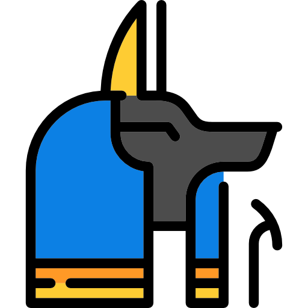

# Anubis Design Doc

> Authors: John Cunnif & Somto Ejinkonye

> Version: v2.0.0

- [Overview](#overview)
    - [Elevator Pitch](#elevator-pitch)
    - [Differences from v1.0.0](differences-from-v1.0.0)
    - [Definitions](#definitions)
- [Services](#services)
    - [Traefik](#traefik)
    - [API](#api)
        - [Zones](#zones)
        - [Responsibilites](#responsibilites)
        - [SSO Authentication](#sso-authentication)
    - [Submission Pipeline](#submission-pipeline)
        - [Kube Job](#kube-job)
        - [Submission State Reporting](submission-state-reporting)
        - [Stages](#stages)
            - [Clone](#clone)
            - [Build](#build)
            - [Test](#test)
    - [Web Frontend](#web-frontend)
        - [Pages](#pages)
    - [Datastores](#datastores)
        - [Mariadb](#mariadb)
        - [Elasticsearch](#elasticsearch)
        - [Kibana](#kibana)
    - [Logging](#logging)
        - [logstash](#logstash)
- [Deployment](#deployment)
    - [Kubernetes](#kubernetes)
        - [Rolling Updates](#rolling-updates)
        - [Longhorn](#longhorn)
        - [OSIRIS Space Cluster](#the-osiris-space-cluster)
    - [Github](#github)
        - [Organization](#organization)
        - [Classroom](#classroom)
- [CLI](#cli)
    - [Installing](#installing-the-cli)
    - [Authenticating](#authenticating-the-cli)
    - [Usage](#cli-usage)
- [Assignments](#assignments)
    - [Creating a new Assignment](#creating-a-new-assignment)
        - [Writing Tests](#writing-tests)
        - [Uploading Tests](#uploading-tests)
        - [Updating Existing Tests](#updating-existing-tests)
        - [Connecting to github classrooms](#connecting-to-github-classrooms)
    - [Getting Autograder Results](#getting-autograder-results)
    

## Overview

### Elevator Pitch

At its core, Anubis is a tool to give Intro to OS students live feedback from their homework assignments while they are working on them. Instead of having students submit a parch file, through github classrooms each student will have their own private repo for every assignment. The way students then submit their work is simply by submitting before the deadline. Students can then push, and therefore submit as many times as they would like before the deadline. 

When a student pushes to thier assignment repo, a job is launched in the Anubis cluster. That job will build their repo, run tests on the results, and store the results in the [datastore](#datastore).

Students can then navigate to the anubis website, where they will sign in through [NYU SSO](#sso). From there, they will be able to see all the current and past assignments, and submissions for their classes. They are able to view all relevent data from their build and tests for a given submission. There they can request a regrade, there by launching a new submission pipeline. While the submission still being processed, the frontend will poll the [API](#api) for updates. In this, the frontend will be containtly updating while the submission is being processed, giving a live and interactive feel to the frontend. Once a submission is processed Anubis will show the students logs from their tests, and builds along with which tests passed and which failed. 

### Differences from v1.0.0

Version 1.0.0 went through many changes over the course of the spring 2020 semester. By the end, it was stable and worked well enough. 

The places version one lacked the most was in its ability to scale. Since it was designed to run on a single server, only verticle scaling was possible. In the hour or so before the deadline for an assignment was the only time the system was stressed by the load. The server would only be able to process a limited number of submissions at a time. 

One other major issues was that github's webhook feature was not stable. It would routenly fail to deliver the webhooks to anubis indicating a new submission was pushed. This issue lead to a great deal of confusion where students could not find their submissions in the frontend because the api were never notified by github.

The primary difference in version two is scale and reliability. We are planning on displaying more meaningful feedback, with an improved UI. Along with this, we are building the new system on the container orchestrator Kubernetes. Not only does this allow us to scale horizontally significantly easier, but we will also be able to have certain guarentees about availibility of services. 

## Services

### Traefik

For our edge router, we will be using [traefik](https://docs.traefik.io/). Traefik will be what actually listens on the servers external ports. All external traffic will be routed through traefik. Above all else, we will be using Traefik's routing features to handle the Ingress of requests.

In version two of Anubis we will be using one domain, and one domain only. No subdomains. Only paths off of `anubis.osiris.services`. The way we can do this is by using some Traefik routers and middleware to route and modify incoming requests as we see them. The result of this is that we can have a single external domain with different rules, and routing depending on the destination of the domain.

| URL                                  | Services     | Requires Basic Auth |
|--------------------------------------|--------------|---------------------|
| anubis.osiris.services/api/public/*  | Public API   | no                  |
| anubis.osiris.services/api/private/* | Private API  | yes                 |
| anubis.osiris.services/kibana        | Kibana       | yes                 |
| anubis.osiris.services/*             | Web Frontend | no                  |

> The above graph shows some of the routing paths, which services they will be routed to, and if they requir [http basic auth](https://en.wikipedia.org/wiki/Basic_access_authentication).

By leveraging these features of traefik, we can make it appear that the services work different when being accessed externally. Namely the basic authentication for certin paths (and therfore services).

> One thing to note here is that when being accessed from within the cluster, none of these rules apply as we would be connecting directly to services.

### API

The API is the backbone of anubis. It is where all the heavy lifting is done. The service relys on both the [elasticsearch](#elasticsearch) and [mariadb](#mariadb) datastores to maintain state.

#### Zones

The API is split into two distinct, and uiquely treated zones. There is a `public` and a `private` zone. All endpoints for Anubis fall within one of these zones. 

These zones are simply paths that are treated differently depending on where the request is external. Namely for the private zone external requests will require http basic auth. By adding this simple level of authentication, we can lock down a section of the more sensative API to only those authenticated from the outside.

#### Responsibilities

The Anubis API is responsible for handling most basic IO, and state managing that happens on the cluster. Some of this includes: 

- Authenticating users
- Providing Class, Assignment, and Submission data to the frontend
- Handling github webhooks
- Handling reports from the submission pipeline cluster
- Handling regrade requests

#### SSO Authentication

To authenticate with the api, a token is required. The only way to get one of these tokens is through NYU Single Sign On. By doing this, we are outsourcing our authentication. This saves a whole lot of headaches while being arguably more secure that if we rolled our own.

In implementation, the when the frontend loads it will attempt to authenticate with the API. If there is a stale or broken token in the current cookies, the frontend will redirect users to the NYU login page. Given that they authenticate there, they will be redirected back to the API, where we will provide them with a token. From there, they will be logged into Anubis. 

All of this is about 20 lines on our end. All that is necessary are some keys from NYU IT.

### Submission Pipeline

#### Kube Job

A given submission pipeline is of the form of a Kubernetes [Job](https://kubernetes.io/docs/concepts/workloads/controllers/job/). These jobs have some built in assurances. A job is configurable to continue to lanuch new containers if a Pod fails.

#### Submission State Reporting

At each and every tage of a submission pipeline, the job will report to the api with a state update. This state is in the form of a string that describes what is currently happening at that moment. This data can then be passed along to a user that is watching their pipeline be processed live.

Each unique per-assignment pipeline is packaged in the form of a docker image.

> See [Creating a new Assignment](#creating-a-new-assignment)

> An error at any stage of the submissions pipeline will result in an error being reported to the API, and the container exiting.

#### Stages

It is importaint to note that at each stage of the submission pipeline, we will be moving execution back and forth between two users. There will be the entrypoint program managing the container as user `anubis`. The `anubis` user will have much higher privaleges than the `student` user. The `student` user will be used whenever executing student code. It will not have any level of access to anything from the `anubis` user.

##### Clone

In this inital stage, we will pull the current repo down from github. After checking out the commit for the current submission, we will also delete the `.git` directory as it is not needed. Lastly we will `chown` the entire repo as `student:student`. This will then be the only place in the container that the student user can read or write to (other than /tmp of course).

##### Build

At this stage we hand execution off to student code for the first time. We will be building the student code _as the `student` user_. The command for building the container will be specified by on a per-assignment basis. The std-out of the build will be captured by the `anubis` user.

Once built, a build report will be sent to the API, along with a state update for the submission. If the student is on the submission page, then they should be see the build info shortly thereafter.

##### Test

Tests will be defined on a per-assignment basis. Again we are executing student code, as the student user.

After each test, we will return to the entrypoint program as the `anubis` user. We will then send a report of the last test before continuing to the next. 

Once we reach the last test, we send off a seperate notification to the API indicating the completion of the pipeline. It is at that point that the API marks the submission as processed.

### Web Frontend

The frontend is designed to be a simple reflection of the backend data. Once authenticated, users will be able to see the classes they are a part of, current and past assignments, and all their submissions. With few exceptions, the frontend is a near one to one translation of the API's data models. Most pages will have a corresponding API endpoint. The data shown onthat page will be in exactly the form of the API response.

The notable exceptions to this simplistic model would be the submission page, the regrade button, and the find-missing button. 

The submission page will poll for new data if the submission is not marked as processed. As it sees new data, it will update what is displayed. 

Located on the submission page, the purpose of the regrade button is to be a simple and easy way for users to request regrades. When clicked, the frontend will hit a special endpoint for requesting regrades. If successful, the submission will be re-enqueued in a submission pipeline.

On the submissions page, the find-missing button will trigger a server side update of the submission data. When the find-missing endpoint is hit, the API will use the graphql API for github to pull all the commits for all the known repos for that user. If it sees commits that were not preveously seen (likely though github not delivering a webhook), then it will create and enqueue the new submissions.

### Datastores

#### Mariadb

Anubis will use the OSIRIS Space Clusters existing MariaDB cluster. That cluster is made from [bitnami's MariaDB chart](https://hub.kubeapps.com/charts/bitnami/mariadb). It runs with 3 read-only replication nodes, along with a main node that does read-write. The underlying MariaDB files are also backed up with a [Longhorn](https://longhorn.io/) persistent volume that has 3x replication in the cluster. That volume has daily snapshots. Redundancy is the name of the game here.

The precice data model that we will be using is a simple relational database. From the API, we will interface with Mariadb via [SQLAlchemy](https://www.sqlalchemy.org/). 

#### Elasticsearch

Anubis uses elasticsearch as a search engine for logging, and event tracking. The [elastic ecosystem](https://www.elastic.co/) has other tools like [kibana](#kibana) and [logstash](#logstash) for visualizing data, and logging. Other than the visualization features, elastic allows us to simply start throwing data at it without defining any meaningful shape. This allows us to just log events and data into elastic to be retrieved, and visualized later.

#### Kibana

The Anubis autograder generates a lot of data. We have intense logging, and event tracking on every service. When something happens on the cluster, it will be indexed into elastic. [Kibana](https://www.elastic.co/kibana) is elastic's data visualization tool. It runs as a website that interfaces with the internal elasticsearch. Through kibana, we can stream live logs, view event data, and create meaningful visualizations. 

The Kibana instance will be accessable via `https://anubis.osiris.services/kibana`, with http basic auth for authenticating.

The API sees when students start their homeworks (create their github repo), and when they are submitting (pushing to their repo). This data is indexed into elasticsearch, and visualized via kibana. In Anubis version one we were able to show graphs of when students were starting vs finishing their assignments. To no ones surprise, the majority of the class was starting very late, with a large influx of submissions in the few hours before each deadline. Furthermore, we can show how long it takes for a student to start their assignment to when they have their tests pass on average. We can also show which tests were causing students the most trouble.

This incredably precise view into the actual data that can be generated on a platform such as Anubis is something that sets it apart from its competitors. We can show meaningful statistics to the professors and TAs on the platform about what went well with their assignment, and where students strugled.

### Logging

> _When it doubt, just log it_

#### Logstash

Logstash itself is a service that your applications can ship their logs to before being indexed into elasticsearch. Its purpose is to act as a natural buffer of log data. It is able to interface with elasticsearch, adjusting the speed of log injestion as needed. In addition to acting as a buffer, it also enriches the data that it sees. For example, the logstash python client will not only ship the log message, but also the file that the log is coming from, along with which node the log is coming from. 

This centralized, and persistent logging is indexed into elasticsearch, and accessed via kiaban. Anubis uses logstash on its API and submission pipeline.

## Deployment

### Kubernetes

The main goal with moving to Kubernetes from a simple single server docker-compose setup was scalability. We needed to scale our load horizontally. No longer was adding more RAM and CPU cores to the VM viable. With more users, we have a greater load. Kuberentes allows us to distribute this load accross the servers in the clusters quite easily. 

In moving to Kube, we are also now able to make guraentees about availibility. In theory, even if sections of physical servers on the cluster go offline Anubis will still remain availible. [More on that later...](#space-cluster)

#### Rolling Updates

In the decisions that were made when considering when expanding Anubis, availibility was of the most importaint. Specifically we needed to move to a platform that would allow us to do _zero_ downtime deploys. Kubernetes has very powerful rolling update features. We can bring up a new version of the Anubis API, verify that this new version is healthy, then bring down the old version. All the while, there will be no degrasions in availibility.

Of all the features of Kubernetes that Anubis leverages, none are quite as importaint as rolling updates. The Anubis API can be updated to a new version with _zero_ downtime. This means we can live patch the API with new versions, with little to no degrasions in service.

#### Longhorn

The Kubernetes [StorageClass](https://kubernetes.io/docs/concepts/storage/storage-classes/) that the Space Cluster supports is Longhorn. It allows us to have replicated data volumes with scheduled snapshots and backups.

All persistent data is stored on 3x replicated Longhorn StorageVolumes. Those volumes all have at least daily snapshots taken of them. At any given time, we can reset any stateful servie to a previous snapshot from the last seven days.

#### The OSIRIS Space Cluster

The OSIRIS Space Cluster is a k3s Kubernetes cluster that is managed by the OSIRIS Lab at NYU Tandon. It is primarily used for research and website hosting. It was designed by John Cunniff to be highly redundant, even in the case of a networking outage / natural desaster.

##### Nodes

The cluster is comprised of Servers that are evenly distributed between the South Data Center (SDC) on Lafeyette Stret in Manhattan and MetroTech Center (MTC) in Rogers Hall in Brooklyn. The nodes are connected via the internal OSIRIS server network. 

##### Networking

There are multiple so called "Ingress Nodes" in both the MTC and SDC. These are nodes that have both public IP addreses and internal OSIRIS IP addresses. These nodes handle all inbound traffic to the cluster via Traefik.

Because there are multiple IP address for the space cluster, the main ingress DNS `space.osiris.services` will always resolve to all of the current IP address. This guarentees greater availibility, as if one IP is down for whatever reason another may be availible.

The public IP addresses that are used are made up of both NYU, and POLY IP addresses. This design is quite purposeful. It will guarentee that even in the event of a network outage at Poly or NYU, the cluster will remain able to handle ingress.

##### Shared Services

The space cluster has a few shared internal services. Namely there is a shared replicated, and backed up MariaDB instance which Anubis will use a datastore. There is also an instance of [Kubernetes-Dashboard](https://github.com/kubernetes/dashboard) running for viewing kubernetes resources. The Space Cluster also provides Longhorn for persistent data.

### Github

#### Organization

Each class that will need a github organization to put all its repos under. The only members of that organization should be the professor and TAs.

The organization should be set up to have push event webhooks to anubis. The endpoint the webhook should push to is https://anubis.osiris.services/api/public/webhook. That endpoint will be hit when there is a push to a repo in that organization.

#### Classroom

[Github classroom](https://classroom.github.com/) is used to create, and distribute repos for assignments. There you can create assignments that will pull from a template repo of your chooseing. A link will be generated that can be distibuted to students. When clicked, that link will generate a new repo for the student within the class organization. As the student is not a part of the organization, they will not be able to see any of the other student repos (given the assginment was made using a private repo).

The best place to put the template repo is within the class organization as a private repo.

One very importaint thing to note here is that in order to be able to create private assignment repo's, the classroom you create must be verified by github. This can take a few weeks, ad a professor needs to email github asking for permission from a .edu email providing their title and whatnot. 

> Getting your github classroom / org approved will likely cause delays if not done at least a month before the semester starts.

## CLI

### Installing the CLI

The command line interface for anubis is packaged as a simple pip package. To install it, make sure you have python3 and pip installed, then from the anubis repo run `make cli`. This will run the pip install command necessary for installing the cli globally. If that was successful, then the `anubis` command will be installed.

### Authenticating the CLI

Primarily, the CLI will make simple calls to the private API via anubis.osiris.services/api/private/*. To do that, it must know the http basic auth password. The first time you run the cli it will prompt you for the username and password. If successful with authenticating, it will save those credentials to `~/.anubis`. 

### CLI Usage

The main purposes of the API is for making it a bit easier for admins to make private API calls. In some cases it will handle the input and output of files. 

Some use cases would be:
- Adding, Updating and Listing student data
- Adding, Updating and Listing assignment data
- Adding, Updating and Listing class data
- Packaging a new assignment tests, and sending its data off to the cluster
- Getting autograded results

## Assignments

_This section is intentionally left blank as it is in active development.

### Creating a new Assignment
#### Writing Tests
#### Uploading Tests
#### Updating existing Tests
#### Connecting to github classrooms
### Getting Autograder Results

