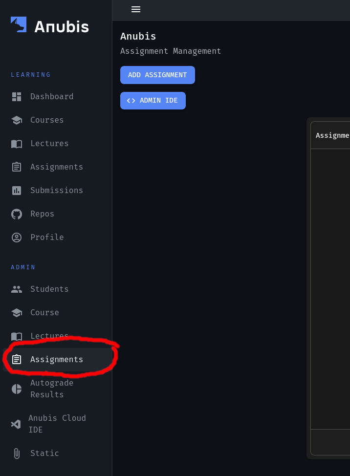

=============================
Creating Assignment on Anubis
=============================

.. WARNING::
   These documentation along with the Anubis Shell Autograde library are a work in progress.
   Consider this a live document.

.. NOTE::
   This documentation only pertains to live shell autograde assignments.

Assignments Page
================

.. NOTE::
   If you do not see the admin navigation tab, then your account lacks the TA permissions. Please
   reach out to your Professor or a fellow TA to have them add you as a TA to the course.

Navigating to admin assignments page
------------------------------------

To create an assignment on Anubis with shell autograding, start by going to the admin assignment page. This
assignments page under the "admin" navigation tab.

   Navigate to Admin Assignments Page

Creating a new assignment
-------------------------

On the admin assignment page, you can create and manage the assignments on Anubis. To create your first assignment,
click the ``Add Assignment`` button in the top left corner.

   Add Assignment Button

This will create a fresh assignment for you with the default assignment configuration for your course. Select your
new assignment from the list by clicking on the row in the table.

   Select Your New Assignment From Table

Assignment settings introduction
--------------------------------

This will bring you to the admin assignment management page. This page has all the settings you will need to configure
your new assignment.

   Assignment Management Page (with default settings)

.. NOTE::
   All new assignments are ``hidden`` by default. Make sure to flip the hidden switch to off and hit save when your
   assignment is ready to be release. The assignment will still not be visible to students until after the release date.

Most of these settings are not relevant for shell autograde assignments, so we will leave them be.
The settings that you will want to always adjust are:

1. Assignment Name
2. Release Date
3. Due Date
4. Grace Date
5. IDE Image

.. WARNING::
   Make sure to keep the ``Autograde Enabled`` setting set to off. This setting is for the other kind of autograding
   that Anubis supports.

Shell Autograde Assignment Settings
===================================

Entering Settings
-----------------

Under the "Beta Settings" section of the assignment management page you can find the settings for shell autograde
assignments.

   Default Assignment Beta Settings

The first thing you will want to do is to enable shell autograding by flipping the switch to on. The next thing is to
enter the repo that the ``exercise.py`` configuration scripts for your assignment live in. Enter this in the form
``<github username/organization>/<repo name>``. Then put in the path within the repo to the ``exercise.py`` for this
assignment. Then hit save.

When saving the assignment settings, some basic checks are performed to make sure that the shell autograde settings you
have entered appear valid. Anubis will reject settings that appear to be invalid. If you believe run into this, and
believe that your settings are valid, reach out to Anubis support or open an issue on github.

   Example Valid Shell Autograde Assignment Settings

Syncing Anubis to Exercise.py
-----------------------------

Anubis needs to keeps a record of which exercises exist for a given assignment to be able to do autograding. Because of
this, we need to make sure Anubis is always up to date with the exercises that are in your assignment's ``exercise.py``
on github.

Anubis does this syncing automatically. Every 60 seconds, the assignments ``exercise.py`` will be read and parsed off
of github. This is done so that you can simply push any changes to the exercises to github, and the changes with
seamlessly propagate to Anubis (with a slight delay).

There is also a button for you to be able to trigger this syncing manually.

   Manual Exercise Sync Button

.. NOTE::
   When the ``exercise.py`` for an assignment is parsed, and an exercise that previously existed was removed, Anubis
   does not delete this exercise. Instead the exercise is switched to ``hidden`` and only TAs/Professors can see it.
   To un-hide this test (ie: re-enable it) all you need to do is add it back to the ``exercise.py``.

Seeing Current Exercises in Anubis
----------------------------------

.. NOTE::
   An important distinction should be made at this point. We have been referring to each task within an Anubis shell
   autograde assignment as an ``exercise``. In Anubis's full autograding solution we call each task a ``test``. As this
   word does not make much sense for this context, we do not expose the word ``test`` to students when referring to each
   task. In some settings and management pages ``exercises`` for shell autograde assignments may be called ``tests``.

To see the current exercises that Anubis is aware of, click on the ``Edit Tests`` button on the assignment page.

   Currently Synced Exercises

Conclusions
===========

Once your shell autograde assignment is configured, you can navigate to the Anubis dashboard page, select the
assignment, and open an IDE for testing.

.. NOTE::
   Please note that currently changes to ``exercise.py`` on github do not propagate to open IDEs. If you make a change
   to ``exercise.py`` on github and want to check it in production, then you will need to close the IDE and open it
   again. This is a planned feature.

Once your assignment is released, students will get an email notification. They can then navigate to Anubis, and open
an IDE to do their assignment.
