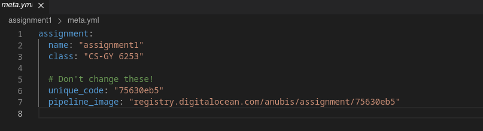

===========
Autograding
===========

.. WARNING::
   It is important to note that the name of the assignment is not how the Anubis system identifies the assignment. The
   identifier is the value of ``unique_code`` in ``meta.yml``. It is important to not change these unless you
   understand what you are doing.

.. NOTE::
   If you detect something that is a problem, you can end the build prematurely by raising a ``Panic``

.. code-block:: sh
   :caption: Create a new assignment

    anubis assignment init 'assignment1' # replace assignment1 with name of your assignment

`official xv6 fork <https://github.com/AnubisLMS/xv6>`_

::

   ├── assignment.py  # The file with the tests for your assignment
   ├── Dockerfile     # Dockerfile for deploying image (install whatever extra software is needed)
   ├── utils.py       # Module with some basic utility functions for autograding
   ├── meta.yml       # Metadata about the assignment
   ├── test.sh        # Script for debugging the assignment tests
   └── pipeline.py    # Script for running tests within pipeline (do not touch)

introduction:
  installing
  components:
     autograde python server
     student shell
     exercise configuration
example configuration
writing an assignment:
  generating exercise file
  debugging:
    run debug server
    run debug shell
